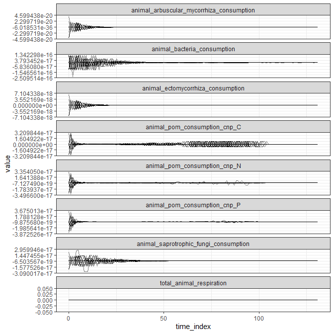
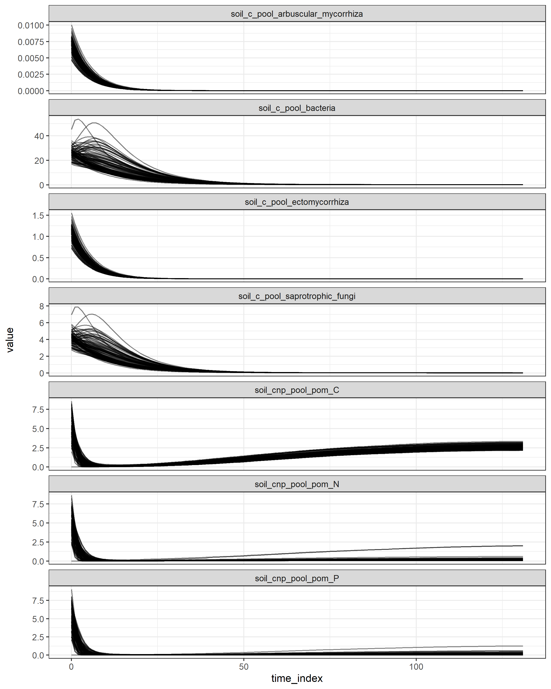
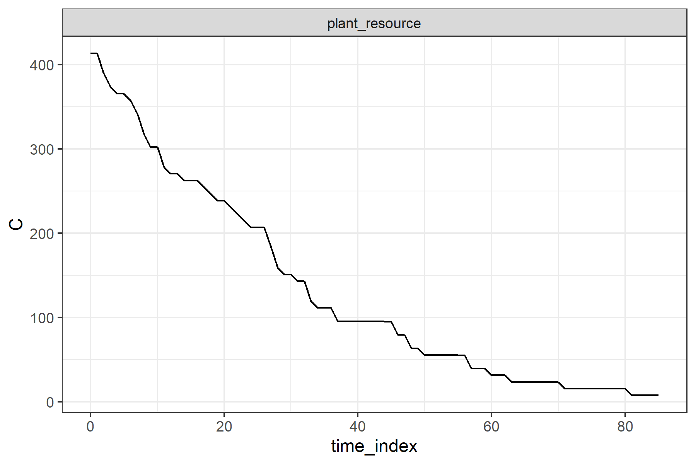

# Empty forest? We need a scenario with persistent animal populations over the simulation period
Lai, Hao Ran
2026-07-02

<!-- markdownlint-disable MD013 MD031 MD055-->

``` r
library(tidync)
library(tidyverse)
library(here)
library(knitr)
library(reticulate)
use_virtualenv(here("ve_latest"), required = TRUE)
source(here("tools/R/tidy_continuous_data.R"))
```

## Preamble

I am conducting a sensitivity analysis for the soil and litter modules.
A sensitivity analysis examines how much of the variation in an output
is attributed to variation in an input. **However, if an output never
varies, it is meaningless to conduct a sensitivity analysis.** This
happens to a few animal-related outputs in the `all_continuous_data.nc`
file. My gut feeling is that the lack of temporal variation is due to
the animal FGs dying off, hence the exploration here.

At the end of this report, I explain why we might want to design a
scenario where there is at least some persistent animal populations, at
least for the purpose of sensitivity analyses.

## Model and data summary

I ran the full `maliau_2` scenario available from Globus:

- config in `data/scenarios/maliau/maliau_2/config`
- data in `data/scenarios/maliau/maliau_2/data`
- The animal functional group is from the file
  `data/scenarios/maliau/maliau_2/data/animal_functional_groups_Maliau_level1.csv`,
  which looks like:

<table>
<colgroup>
<col style="width: 8%" />
<col style="width: 2%" />
<col style="width: 13%" />
<col style="width: 5%" />
<col style="width: 8%" />
<col style="width: 6%" />
<col style="width: 5%" />
<col style="width: 6%" />
<col style="width: 9%" />
<col style="width: 5%" />
<col style="width: 5%" />
<col style="width: 6%" />
<col style="width: 3%" />
<col style="width: 3%" />
<col style="width: 8%" />
</colgroup>
<thead>
<tr>
<th style="text-align: left;">name</th>
<th style="text-align: left;">taxa</th>
<th style="text-align: left;">diet</th>
<th style="text-align: left;">metabolic_type</th>
<th style="text-align: left;">reproductive_environment</th>
<th style="text-align: left;">reproductive_type</th>
<th style="text-align: left;">development_type</th>
<th style="text-align: left;">development_status</th>
<th style="text-align: left;">offspring_functional_group</th>
<th style="text-align: left;">excretion_type</th>
<th style="text-align: left;">migration_type</th>
<th style="text-align: left;">vertical_occupancy</th>
<th style="text-align: right;">birth_mass</th>
<th style="text-align: right;">adult_mass</th>
<th style="text-align: left;">density_individuals_m2</th>
</tr>
</thead>
<tbody>
<tr>
<td style="text-align: left;">Herbivorous_endotherms</td>
<td style="text-align: left;">mammal</td>
<td
style="text-align: left;">wood_seeds_fruit_foliage_flowers_fungi</td>
<td style="text-align: left;">endothermic</td>
<td style="text-align: left;">terrestrial</td>
<td style="text-align: left;">iteroparous</td>
<td style="text-align: left;">direct</td>
<td style="text-align: left;">adult</td>
<td style="text-align: left;">Herbivorous_endotherms</td>
<td style="text-align: left;">ureotelic</td>
<td style="text-align: left;">none</td>
<td style="text-align: left;">ground</td>
<td style="text-align: right;">100</td>
<td style="text-align: right;">2915</td>
<td style="text-align: left;">None</td>
</tr>
</tbody>
</table>

- VE version: v0.2.0 (dev version; commit
  [3c6e75](https://github.com/ImperialCollegeLondon/virtual_ecosystem/commit/3c6e752e6ca3a8a22239bf6112e14236528e32e3))
- OS: Windows 11

## Animal continuous state variables

Currently, I’m examining:

- `animal_arbuscular_mycorrhiza_consumption`
- `animal_bacteria_consumption`
- `animal_ectomycorrhiza_consumption`
- `animal_pom_consumption_cnp`
- `animal_saprotrophic_fungi_consumption`
- `total_animal_respiration`

``` r
animal_vars <- c(
  "animal_arbuscular_mycorrhiza_consumption",
  "animal_bacteria_consumption",
  "animal_ectomycorrhiza_consumption",
  "animal_pom_consumption_cnp",
  "animal_saprotrophic_fungi_consumption",
  "total_animal_respiration"
)
animal_cont <- tidy_continuous_data(
  here("data/scenarios/maliau/maliau_2/out/all_continuous_data.nc"),
  variables = animal_vars
)
```

First I saw that the range of these state variables are very small. Are
they truly very small, or are they numerical imprecisions that need to
be clamped to zero?

``` r
animal_cont |>
  group_by(variable) |>
  summarise(min = min(value), max = max(value))
```

    # A tibble: 6 × 3
      variable                                       min      max
      <chr>                                        <dbl>    <dbl>
    1 animal_arbuscular_mycorrhiza_consumption -4.18e-20 4.18e-20
    2 animal_bacteria_consumption              -1.17e-16 2.33e-16
    3 animal_ectomycorrhiza_consumption        -6.46e-18 6.46e-18
    4 animal_pom_consumption_cnp               -3.53e-17 3.33e-17
    5 animal_saprotrophic_fungi_consumption    -2.82e-17 2.80e-17
    6 total_animal_respiration                  0        0

Here’s how the variables looked over simulation time steps:

``` r
animal_cont |>
  unite("variable2", variable, element, na.rm = TRUE) |>
  ggplot() +
  facet_wrap(~variable2, ncol = 1, scales = "free_y") +
  geom_line(aes(time_index, value, group = cell_id), alpha = 0.5) +
  theme_bw()
```



``` r
animal_cohort <- read_csv(
  here("data/scenarios/maliau/maliau_2/out/animal_cohort_data.csv")
)
# add one to the time index because python starts from zero
max_cohort_time <- max(animal_cohort$time_index) + 1
```

Before proceeding, I checked the animal cohort data and saw that all
cohorts persisted until the final time step 132.

## Resource continuous state variables

Following Nick’s suggestion, I also checked the temporal trends in
resource availability:

``` r
resource_vars <- c(
  "soil_c_pool_arbuscular_mycorrhiza",
  "soil_c_pool_bacteria",
  "soil_c_pool_ectomycorrhiza",
  "soil_c_pool_saprotrophic_fungi",
  "soil_cnp_pool_pom"
)

resource_cont <- tidy_continuous_data(
  here("data/scenarios/maliau/maliau_2/out/all_continuous_data.nc"),
  variables = resource_vars
)

resource_cont |>
  unite("variable2", variable, element, na.rm = TRUE) |>
  ggplot() +
  facet_wrap(~variable2, ncol = 1, scales = "free_y") +
  geom_line(aes(time_index, value, group = cell_id), alpha = 0.5) +
  theme_bw()
```



## Trophic interactions

In contrast, the resource consumption by all animals stay at zero
without any numeric imprecision.

``` r
# source function to post-process trophic interactions from #243
# this is a placeholder under Nick's PR is merged
source_python(
  "https://github.com/ImperialCollegeLondon/ve_data_science/raw/3706cdcb0281a021cafa91a081c74f9f1b678cfb/tools/python/animal/trophic_mass_flow.py"
)

# read the trophic interactions output and process them for plotting
trophic_interactions <- read_csv(
  here("data/scenarios/maliau/maliau_2/out/animal_trophic_interactions.csv")
)
trophic_analysis <- TrophicFlowAnalysis(trophic_interactions)
```

    trophic flow initialised

``` r
trophic_analysis$group_and_aggregate()
```

    Grouping by ['time_index', 'resource_kind'] and summing C...
     Successfully grouped 132 rows

``` r
# plot
py_to_r(trophic_analysis$group_df) |>
  ggplot() +
  geom_line(aes(time_index, C)) +
  facet_wrap(~resource_kind, ncol = 1) +
  theme_bw()
```



## Questions

A few follow-up questions upon seeing the temporal graphs:

- Why do we still see non-zero values in some variables long after all
  animals have gone extinct since time step 132?
- Presumably these variables are positive only; what do the negative
  values mean? The way they fluctuate almost symmetrically around zero
  makes me suspect that the non-zero values are not true non-zeros but
  numerical imprecision.
- There seems to be some relationship with resource availability. But
  there is no animal to consume then at later time steps?

*If these trends are numerical artefacts rather than true consumption
and respiration rates, then there is not much point to read on.*

## Why do we need persistent animal populations

Mainly so that we can include animal-related state variables into the
sensitivity analyses. More importantly, the animal variables feed back
into the non-animal variables. Unless we are truly aiming for an
empty-forest scenario, we will be left with a half-complete sensitivity
analysis.

Should we consider an alternative set of animal FG definitions?
Currently `maliau_2` uses the level 1 definition, which contain only a
single herbivorous endotherm that always go extinct very early on. Has
anyone run VE with the level 2 definitions? If the level 2 groups also
go extinct, should we consider an alternative set (perhaps more basal in
tropic levels) that can persist over time, and hence continue to keep
the animal and non-animal components coupled until the end of
simulation?
