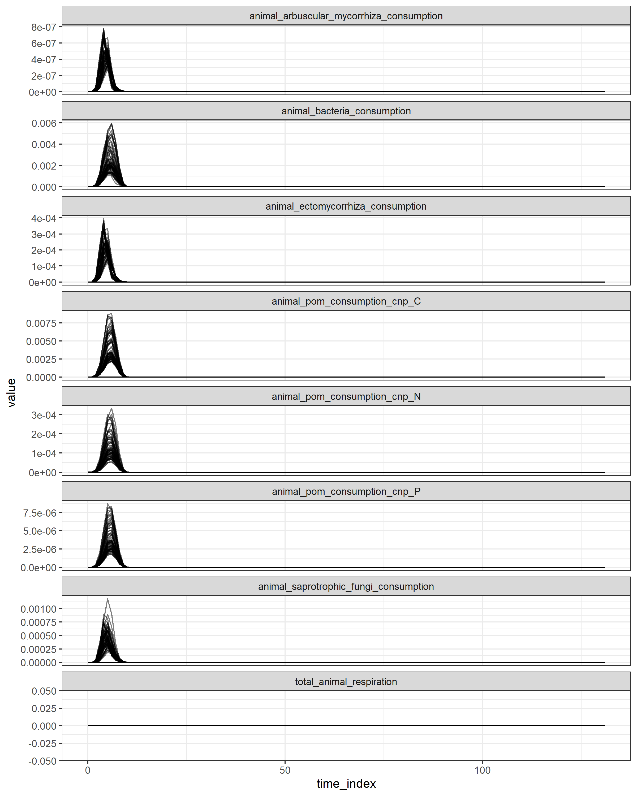
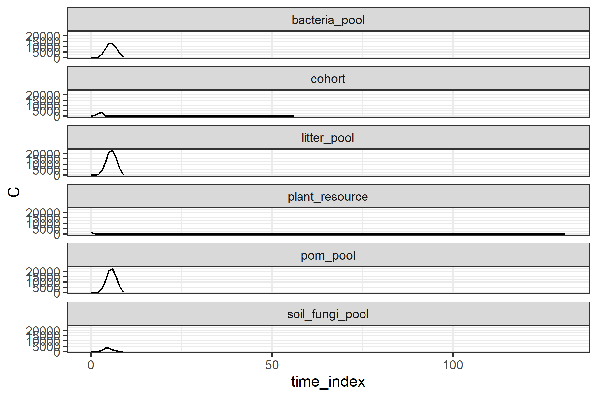
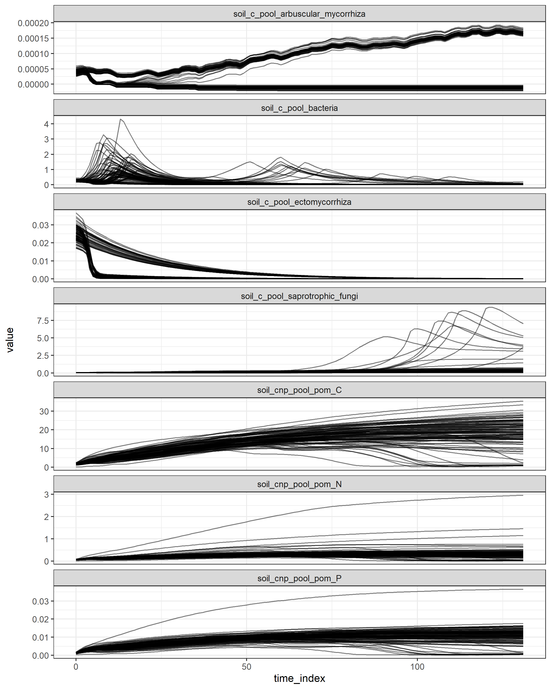

# Troubleshooting continuous outputs related to animals
Lai, Hao Ran
2026-08-10

<!-- markdownlint-disable MD013 MD031 MD055-->

``` r
library(tidync)
library(tidyverse)
library(here)
library(knitr)
library(reticulate)
use_virtualenv(here(".venv"), required = TRUE)
source(here("tools/R/R/tidy_continuous_data.R"))
source(here("tools/R/R/get_ve_variables.R"))
```

## Preamble

<div>

> **Outdated**
>
> I am conducting a sensitivity analysis for the soil and litter
> modules. A sensitivity analysis examines how much of the variation in
> an output is attributed to variation in an input. **However, if an
> output never varies, it is meaningless to conduct a sensitivity
> analysis.** This happens to a few animal-related outputs in the
> `all_continuous_data.nc` file. My gut feeling is that the lack of
> temporal variation is due to the animal FGs dying off, hence the
> exploration here.
>
> At the end of this report, I explain why we might want to design a
> scenario where there is at least some persistent animal populations,
> at least for the purpose of sensitivity analyses.

</div>

Most if not all of the issues raised previously have been resolved. This
report shows the some of the latest figures of VE outputs related to
animal diet.

## Model and data summary

I ran the full `maliau_2` scenario available from Globus using `uv run`:

``` bash
uv run --group dev-pinned \
  ve_run data/scenarios/maliau/maliau_2/config/abiotic_simple_config.toml \
  data/scenarios/maliau/maliau_2/config/animal_config.toml \
  data/scenarios/maliau/maliau_2/config/data_config.toml \
  data/scenarios/maliau/maliau_2/config/hydrology_config.toml \
  data/scenarios/maliau/maliau_2/config/litter_config.toml \
  data/scenarios/maliau/maliau_2/config/plant_config.toml \
  data/scenarios/maliau/maliau_2/config/soil_config.toml \
  --out data/scenarios/maliau/maliau_2/out \
  --log data/scenarios/maliau/maliau_2/out/logfile.log
```

- Config in `data/scenarios/maliau/maliau_2/config`
- Data in `data/scenarios/maliau/maliau_2/data`
- The animal functional group was from the file
  `data/scenarios/maliau/maliau_2/data/animal_functional_groups_Maliau_level3.csv`
  as below. The FG of interest in `Detritivorous_soil_earthworms` that
  consumes `detritus_fungi_pom_bacteria`.

<table>
<colgroup>
<col style="width: 11%" />
<col style="width: 3%" />
<col style="width: 17%" />
<col style="width: 4%" />
<col style="width: 7%" />
<col style="width: 5%" />
<col style="width: 5%" />
<col style="width: 5%" />
<col style="width: 11%" />
<col style="width: 4%" />
<col style="width: 4%" />
<col style="width: 5%" />
<col style="width: 3%" />
<col style="width: 3%" />
<col style="width: 6%" />
</colgroup>
<thead>
<tr>
<th style="text-align: left;">name</th>
<th style="text-align: left;">taxa</th>
<th style="text-align: left;">diet</th>
<th style="text-align: left;">metabolic_type</th>
<th style="text-align: left;">reproductive_environment</th>
<th style="text-align: left;">reproductive_type</th>
<th style="text-align: left;">development_type</th>
<th style="text-align: left;">development_status</th>
<th style="text-align: left;">offspring_functional_group</th>
<th style="text-align: left;">excretion_type</th>
<th style="text-align: left;">migration_type</th>
<th style="text-align: left;">vertical_occupancy</th>
<th style="text-align: right;">birth_mass</th>
<th style="text-align: right;">adult_mass</th>
<th style="text-align: left;">density_individuals_m2</th>
</tr>
</thead>
<tbody>
<tr>
<td style="text-align: left;">Carnivorous_arboreal_endotherms</td>
<td style="text-align: left;">bird</td>
<td style="text-align: left;">vertebrates</td>
<td style="text-align: left;">endothermic</td>
<td style="text-align: left;">terrestrial</td>
<td style="text-align: left;">iteroparous</td>
<td style="text-align: left;">direct</td>
<td style="text-align: left;">adult</td>
<td style="text-align: left;">Carnivorous_arboreal_endotherms</td>
<td style="text-align: left;">uricotelic</td>
<td style="text-align: left;">none</td>
<td style="text-align: left;">canopy</td>
<td style="text-align: right;">3.32e-02</td>
<td style="text-align: right;">5.550e-01</td>
<td style="text-align: left;">None</td>
</tr>
<tr>
<td style="text-align: left;">Herbivorous_arboreal_endotherms</td>
<td style="text-align: left;">bird</td>
<td style="text-align: left;">fruit_nectar</td>
<td style="text-align: left;">endothermic</td>
<td style="text-align: left;">terrestrial</td>
<td style="text-align: left;">iteroparous</td>
<td style="text-align: left;">direct</td>
<td style="text-align: left;">adult</td>
<td style="text-align: left;">Herbivorous_arboreal_endotherms</td>
<td style="text-align: left;">uricotelic</td>
<td style="text-align: left;">none</td>
<td style="text-align: left;">canopy</td>
<td style="text-align: right;">1.16e-03</td>
<td style="text-align: right;">7.000e-03</td>
<td style="text-align: left;">None</td>
</tr>
<tr>
<td style="text-align: left;">Omnivorous_endotherms</td>
<td style="text-align: left;">bird</td>
<td style="text-align: left;">fruit_invertebrates_seeds_foliage</td>
<td style="text-align: left;">endothermic</td>
<td style="text-align: left;">terrestrial</td>
<td style="text-align: left;">iteroparous</td>
<td style="text-align: left;">direct</td>
<td style="text-align: left;">adult</td>
<td style="text-align: left;">Omnivorous_endotherms</td>
<td style="text-align: left;">uricotelic</td>
<td style="text-align: left;">none</td>
<td style="text-align: left;">ground</td>
<td style="text-align: right;">8.80e-02</td>
<td style="text-align: right;">1.960e+00</td>
<td style="text-align: left;">None</td>
</tr>
<tr>
<td style="text-align: left;">Detritivorous_soil_earthworms</td>
<td style="text-align: left;">invertebrate</td>
<td style="text-align: left;">detritus_fungi_pom_bacteria</td>
<td style="text-align: left;">ectothermic</td>
<td style="text-align: left;">terrestrial</td>
<td style="text-align: left;">iteroparous</td>
<td style="text-align: left;">direct</td>
<td style="text-align: left;">adult</td>
<td style="text-align: left;">Detritivorous_soil_earthworms</td>
<td style="text-align: left;">ureotelic</td>
<td style="text-align: left;">none</td>
<td style="text-align: left;">soil</td>
<td style="text-align: right;">5.70e-06</td>
<td style="text-align: right;">1.237e-03</td>
<td style="text-align: left;">None</td>
</tr>
<tr>
<td style="text-align: left;">Wood_bark_feeding_ground_mammals</td>
<td style="text-align: left;">mammal</td>
<td style="text-align: left;">wood_foliage_fruit_seeds</td>
<td style="text-align: left;">endothermic</td>
<td style="text-align: left;">terrestrial</td>
<td style="text-align: left;">iteroparous</td>
<td style="text-align: left;">direct</td>
<td style="text-align: left;">adult</td>
<td style="text-align: left;">Wood_bark_feeding_ground_mammals</td>
<td style="text-align: left;">ureotelic</td>
<td style="text-align: left;">none</td>
<td style="text-align: left;">ground</td>
<td style="text-align: right;">3.67e-01</td>
<td style="text-align: right;">1.091e+01</td>
<td style="text-align: left;">None</td>
</tr>
<tr>
<td style="text-align: left;">Herbivorous_terrestrial_invertebrates</td>
<td style="text-align: left;">invertebrate</td>
<td style="text-align: left;">detritus_fungi_algae</td>
<td style="text-align: left;">ectothermic</td>
<td style="text-align: left;">terrestrial</td>
<td style="text-align: left;">iteroparous</td>
<td style="text-align: left;">direct</td>
<td style="text-align: left;">adult</td>
<td style="text-align: left;">Herbivorous_terrestrial_invertebrates</td>
<td style="text-align: left;">uricotelic</td>
<td style="text-align: left;">none</td>
<td style="text-align: left;">ground</td>
<td style="text-align: right;">4.00e-05</td>
<td style="text-align: right;">1.500e-02</td>
<td style="text-align: left;">None</td>
</tr>
<tr>
<td style="text-align: left;">Omnivorous_ground_reptile</td>
<td style="text-align: left;">reptile</td>
<td
style="text-align: left;">foliage_mushrooms_fruit_flowers_invertebrates_vertebrates</td>
<td style="text-align: left;">ectothermic</td>
<td style="text-align: left;">terrestrial</td>
<td style="text-align: left;">iteroparous</td>
<td style="text-align: left;">direct</td>
<td style="text-align: left;">adult</td>
<td style="text-align: left;">Omnivorous_ground_reptile</td>
<td style="text-align: left;">uricotelic</td>
<td style="text-align: left;">none</td>
<td style="text-align: left;">ground</td>
<td style="text-align: right;">5.25e-02</td>
<td style="text-align: right;">1.300e+01</td>
<td style="text-align: left;">None</td>
</tr>
<tr>
<td style="text-align: left;">Omnivorous_arboreal_endotherms</td>
<td style="text-align: left;">mammal</td>
<td
style="text-align: left;">foliage_invertebrates_fruit_flowers_seeds</td>
<td style="text-align: left;">endothermic</td>
<td style="text-align: left;">terrestrial</td>
<td style="text-align: left;">iteroparous</td>
<td style="text-align: left;">direct</td>
<td style="text-align: left;">adult</td>
<td style="text-align: left;">Omnivorous_arboreal_endotherms</td>
<td style="text-align: left;">ureotelic</td>
<td style="text-align: left;">none</td>
<td style="text-align: left;">canopy</td>
<td style="text-align: right;">4.00e-01</td>
<td style="text-align: right;">3.992e+00</td>
<td style="text-align: left;">None</td>
</tr>
<tr>
<td style="text-align: left;">Herbivorous_endotherms</td>
<td style="text-align: left;">mammal</td>
<td style="text-align: left;">foliage_fungi_fruit_flowers_seeds</td>
<td style="text-align: left;">endothermic</td>
<td style="text-align: left;">terrestrial</td>
<td style="text-align: left;">iteroparous</td>
<td style="text-align: left;">direct</td>
<td style="text-align: left;">adult</td>
<td style="text-align: left;">Herbivorous_endotherms</td>
<td style="text-align: left;">ureotelic</td>
<td style="text-align: left;">none</td>
<td style="text-align: left;">ground</td>
<td style="text-align: right;">1.06e-01</td>
<td style="text-align: right;">2.000e+00</td>
<td style="text-align: left;">None</td>
</tr>
<tr>
<td style="text-align: left;">Carnivorous_endotherms</td>
<td style="text-align: left;">mammal</td>
<td style="text-align: left;">vertebrates</td>
<td style="text-align: left;">endothermic</td>
<td style="text-align: left;">terrestrial</td>
<td style="text-align: left;">iteroparous</td>
<td style="text-align: left;">direct</td>
<td style="text-align: left;">adult</td>
<td style="text-align: left;">Carnivorous_endotherms</td>
<td style="text-align: left;">ureotelic</td>
<td style="text-align: left;">none</td>
<td style="text-align: left;">ground</td>
<td style="text-align: right;">1.50e-01</td>
<td style="text-align: right;">2.050e+01</td>
<td style="text-align: left;">None</td>
</tr>
<tr>
<td style="text-align: left;">Carnivorous_terrestrial_ectotherms</td>
<td style="text-align: left;">reptile</td>
<td
style="text-align: left;">invertebrates_fish_carcasses_vertebrates</td>
<td style="text-align: left;">ectothermic</td>
<td style="text-align: left;">terrestrial</td>
<td style="text-align: left;">iteroparous</td>
<td style="text-align: left;">direct</td>
<td style="text-align: left;">adult</td>
<td style="text-align: left;">Carnivorous_terrestrial_ectotherms</td>
<td style="text-align: left;">uricotelic</td>
<td style="text-align: left;">none</td>
<td style="text-align: left;">ground</td>
<td style="text-align: right;">4.00e-02</td>
<td style="text-align: right;">3.000e+01</td>
<td style="text-align: left;">None</td>
</tr>
<tr>
<td style="text-align: left;">Carnivorous_arboreal_ectotherms</td>
<td style="text-align: left;">reptile</td>
<td style="text-align: left;">invertebrates</td>
<td style="text-align: left;">ectothermic</td>
<td style="text-align: left;">terrestrial</td>
<td style="text-align: left;">iteroparous</td>
<td style="text-align: left;">direct</td>
<td style="text-align: left;">adult</td>
<td style="text-align: left;">Carnivorous_arboreal_ectotherms</td>
<td style="text-align: left;">uricotelic</td>
<td style="text-align: left;">none</td>
<td style="text-align: left;">canopy</td>
<td style="text-align: right;">2.11e-03</td>
<td style="text-align: right;">4.870e-02</td>
<td style="text-align: left;">None</td>
</tr>
<tr>
<td style="text-align: left;">Blood_feeding_ectoparasites</td>
<td style="text-align: left;">invertebrate</td>
<td style="text-align: left;">blood</td>
<td style="text-align: left;">ectothermic</td>
<td style="text-align: left;">terrestrial</td>
<td style="text-align: left;">iteroparous</td>
<td style="text-align: left;">direct</td>
<td style="text-align: left;">adult</td>
<td style="text-align: left;">Blood_feeding_ectoparasites</td>
<td style="text-align: left;">uricotelic</td>
<td style="text-align: left;">none</td>
<td style="text-align: left;">ground</td>
<td style="text-align: right;">0.00e+00</td>
<td style="text-align: right;">1.800e-06</td>
<td style="text-align: left;">None</td>
</tr>
<tr>
<td style="text-align: left;">Herbivorous_arboreal_invertebrates</td>
<td style="text-align: left;">invertebrate</td>
<td style="text-align: left;">foliage</td>
<td style="text-align: left;">ectothermic</td>
<td style="text-align: left;">terrestrial</td>
<td style="text-align: left;">iteroparous</td>
<td style="text-align: left;">direct</td>
<td style="text-align: left;">adult</td>
<td style="text-align: left;">Herbivorous_arboreal_invertebrates</td>
<td style="text-align: left;">uricotelic</td>
<td style="text-align: left;">none</td>
<td style="text-align: left;">canopy</td>
<td style="text-align: right;">1.00e-07</td>
<td style="text-align: right;">9.850e-04</td>
<td style="text-align: left;">None</td>
</tr>
</tbody>
</table>

- VE version: v0.2.1 (dev-pinned; commit
  [0f67349](https://github.com/ImperialCollegeLondon/virtual_ecosystem/commit/0f673499b4af7d8f19d7c3990a77ae903f0b1f7f))
- OS: Windows 11

## Animal continuous state variables

I examined:

- `animal_arbuscular_mycorrhiza_consumption`
- `animal_bacteria_consumption`
- `animal_ectomycorrhiza_consumption`
- `animal_pom_consumption_cnp`
- `animal_saprotrophic_fungi_consumption`
- `total_animal_respiration`

``` r
animal_vars <- c(
  "animal_arbuscular_mycorrhiza_consumption",
  "animal_bacteria_consumption",
  "animal_ectomycorrhiza_consumption",
  "animal_pom_consumption_cnp",
  "animal_saprotrophic_fungi_consumption",
  "total_animal_respiration"
)

ve_output_path <- here("data/scenarios/maliau/maliau_2/out/model_data.zarr")

animal_cont <- tidy_continuous_data(ve_output_path, variables = animal_vars)
```

<div>

> **Outdated**
>
> First I saw that the range of these state variables are very small.
> Are they truly very small, or are they numerical imprecisions that
> need to be clamped to zero?

</div>

The state variables are no longer always minute, they also showed peaks
that correspond to the density of microbial consumers (see *Trophic
interactions*). However, their lower bounds were not perfectly zero.

``` r
animal_cont |>
  group_by(variable) |>
  summarise(min = min(value), max = max(value))
```

    # A tibble: 6 × 3
      variable                                       min         max
      <chr>                                        <dbl>       <dbl>
    1 animal_arbuscular_mycorrhiza_consumption -8.09e-22 0.000000784
    2 animal_bacteria_consumption              -7.30e-18 0.00596    
    3 animal_ectomycorrhiza_consumption        -1.05e-19 0.000398   
    4 animal_pom_consumption_cnp               -1.17e-16 0.00881    
    5 animal_saprotrophic_fungi_consumption    -2.92e-17 0.00119    
    6 total_animal_respiration                  0        0          

``` r
animal_cont |>
  unite("variable2", variable, element, na.rm = TRUE) |>
  ggplot() +
  facet_wrap(~variable2, ncol = 1, scales = "free_y") +
  geom_line(aes(time_index, value, group = cell_id), alpha = 0.5) +
  theme_bw()
```



## Trophic interactions

``` r
# source function to post-process trophic interactions from #243
# this is a placeholder under Nick's PR is merged
source_python(
  "https://github.com/ImperialCollegeLondon/ve_data_science/raw/3706cdcb0281a021cafa91a081c74f9f1b678cfb/tools/python/animal/trophic_mass_flow.py"
)

# read the trophic interactions output and process them for plotting
trophic_interactions <- read_csv(
  here("data/scenarios/maliau/maliau_2/out/animal_trophic_interactions.csv")
)
trophic_analysis <- TrophicFlowAnalysis(trophic_interactions)
```

    trophic flow initialised

``` r
trophic_analysis$group_and_aggregate()
```

    Grouping by ['time_index', 'resource_kind'] and summing C...
     Successfully grouped 224 rows

``` r
# plot
py_to_r(trophic_analysis$group_df) |>
  ggplot() +
  geom_line(aes(time_index, C)) +
  facet_wrap(~resource_kind, scales = "free_y", ncol = 1) +
  theme_bw()
```



``` r
animal_cohort <- read_csv(
  here("data/scenarios/maliau/maliau_2/out/animal_cohort_data.csv")
)
# add one to the time index because python starts from zero
max_cohort_time <- max(animal_cohort$time_index) + 1
```

Before proceeding, I checked the animal cohort data and saw that at
least some cohorts persisted until the final time step 132.

## Resource continuous state variables

Following Nick’s suggestion, I also checked the temporal trends in
resource availability:

``` r
resource_vars <- c(
  "soil_c_pool_arbuscular_mycorrhiza",
  "soil_c_pool_bacteria",
  "soil_c_pool_ectomycorrhiza",
  "soil_c_pool_saprotrophic_fungi",
  "soil_cnp_pool_pom"
)

resource_cont <- tidy_continuous_data(ve_output_path, variables = resource_vars)

resource_cont |>
  unite("variable2", variable, element, na.rm = TRUE) |>
  ggplot() +
  facet_wrap(~variable2, ncol = 1, scales = "free_y") +
  geom_line(aes(time_index, value, group = cell_id), alpha = 0.5) +
  theme_bw()
```



## Questions

<div>

> **Outdated**
>
> A few follow-up questions upon seeing the temporal graphs:
>
> - Why do we still see non-zero values in some variables long after all
>   animals have gone extinct since time step 132?
> - Presumably these variables are positive only; what do the negative
>   values mean? The way they fluctuate almost symmetrically around zero
>   makes me suspect that the non-zero values are not true non-zeros but
>   numerical imprecision.
> - There seems to be some relationship with resource availability. But
>   there is no animal to consume then at later time steps?
>
> *If these trends are numerical artefacts rather than true consumption
> and respiration rates, then there is not much point to read on.*

</div>

The only persisting question seems to be the non-zero lower bounds of
some animal continuous variables.

## Why do we need persistent animal populations

<div>

> **Outdated**
>
> Mainly so that we can include animal-related state variables into the
> sensitivity analyses. More importantly, the animal variables feed back
> into the non-animal variables. Unless we are truly aiming for an
> empty-forest scenario, we will be left with a half-complete
> sensitivity analysis.
>
> Should we consider an alternative set of animal FG definitions?
> Currently `maliau_2` uses the level 1 definition, which contain only a
> single herbivorous endotherm that always go extinct very early on. Has
> anyone run VE with the level 2 definitions? If the level 2 groups also
> go extinct, should we consider an alternative set (perhaps more basal
> in tropic levels) that can persist over time, and hence continue to
> keep the animal and non-animal components coupled until the end of
> simulation?

</div>

We do have persistent animal populations now until the end of the
simulation, but note that we are using level 3 FG input data.
