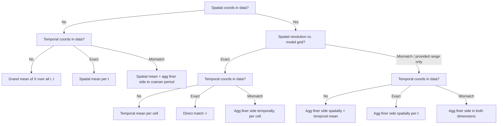

<!-- markdownlint-disable MD013 MD060 MD033 MD012 -->

## Background

For the Maliau scenarios, VE produces predictions of a state variable $X(i, t)$,
where $i$ indexes a spatial cell ID and $t$ indexes a monthly time step.
(Let's ignore other dimensions such as element and PFT here.)
However, empirical data used for validation are heterogeneous:
a given dataset may or may not carry spatial coordinates and/or a time stamp.
Where coordinates exist, their resolution may not match that of our model
(i.e., the temporal resolution may not be monthly, or the spatial resolution
may not be $100 \times 100$ m^2^).

We need to agree on a decision tree of matching validation data to model
predictions. Currently the task is tracked as Issue [#340](https://github.com/ImperialCollegeLondon/ve_data_science/issues/340).

## Scenario matrix

Crossing the spatial and temporal dimensions --- each with three levels (absent,
exact match, resolution mismatch) --- yields a $3 \times 3$ matrix of nine validation
scenarios. Please check if I've missed anything.

| | **T0: no time coord** | **T1: exact (monthly)** | **T2: resolution mismatch/range only** |
|:---|:---|:---|:---|
| **S0: no space coord** | Grand mean of $X$ over all $i$, $t$ | Spatial mean per $t$ | Spatial mean + agg finer side to coarser period |
| **S1: exact grid match** | Temporal mean per cell | Direct match ⭐ | Agg finer side temporally, per cell |
| **S2: resolution mismatch/range only** | Agg finer side spatially + temporal mean | Agg finer side spatially per $t$ | Agg finer side in both dimensions |

Note that "resolution mismatch" covers two sub-cases: data are finer than predictions
and therefore need upscaling, and vice versa. But this is a detail that we can
discuss next time.

## Decision tree

The matrix translates directly into a decision tree. The first node split by spatial coordinates, and the second nodes by temporal coordinates.

**Discussing and deciding on this decision tree will help us map it directly to a nested `if`-`else` chain in code.**
