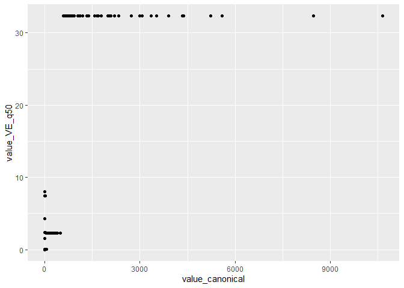

# Soil–Litter validation progress report

Lai, Hao Ran
2026-10-01

Scenario is Maliau 2

    library(tidyverse)

    Warning: package 'tidyverse' was built under R version 4.6.1

    Warning: package 'ggplot2' was built under R version 4.6.1

    Warning: package 'tibble' was built under R version 4.6.1

    Warning: package 'tidyr' was built under R version 4.6.1

    Warning: package 'readr' was built under R version 4.6.1

    Warning: package 'dplyr' was built under R version 4.6.1

    Warning: package 'stringr' was built under R version 4.6.1

    Warning: package 'forcats' was built under R version 4.6.1

    Warning: package 'lubridate' was built under R version 4.6.1

    ── Attaching core tidyverse packages ──────────────────────── tidyverse 2.0.0 ──
    ✔ dplyr     1.2.1     ✔ readr     2.2.0
    ✔ forcats   1.0.1     ✔ stringr   1.6.0
    ✔ ggplot2   4.0.3     ✔ tibble    3.3.1
    ✔ lubridate 1.9.5     ✔ tidyr     1.3.2
    ✔ purrr     1.2.2
    ── Conflicts ────────────────────────────────────────── tidyverse_conflicts() ──
    ✖ dplyr::filter() masks stats::filter()
    ✖ dplyr::lag()    masks stats::lag()
    ℹ Use the conflicted package (<http://conflicted.r-lib.org/>) to force all conflicts to become errors

    library(arrow)

    Warning: package 'arrow' was built under R version 4.6.1

    Attaching package: 'arrow'

    The following object is masked from 'package:lubridate':

        duration

    The following object is masked from 'package:utils':

        timestamp

    library(sf)

    Warning: package 'sf' was built under R version 4.6.1

    Linking to GEOS 3.14.1, GDAL 3.12.1, PROJ 9.7.1; sf_use_s2() is TRUE

    library(toml)

    Warning: package 'toml' was built under R version 4.6.1

    library(tmap)

    Warning: package 'tmap' was built under R version 4.6.1

    library(here)

    here() starts at C:/Users/User/Documents/ve_data_science

    source(here("tools/R/R/valdb.R"))

    # Read the validation database
    val_db_combined <-
      open_dataset(here("data/derived/soil/validation/database_combined")) |>
      collect()

    screened <- list_screening_records(here("data/derived/soil/validation/sources"))
    n_screened <- length(screened)
    n_datasets <- length(unique(val_db_combined$dataset))
    n_data <- nrow(val_db_combined)
    p_within_temporal <- val_db_combined$temporal_join_class |>
      table() |>
      proportions() |>
      pluck("within")
    p_within_spatial <- val_db_combined$spatial_join_class |>
      table() |>
      proportions() |>
      pluck("within")

I screened a total of 103 datasets or literature, and obtained 8 that
can be included into the validation database. The included datasets
contained a total of 1849 data points. 100% of data points fall within
the simulation’s temporal range, but only 1.1% fall within the spatial
extent.

    # draw the map
    unique_locations <-
      val_db_combined |>
      distinct(longitude, latitude) |>
      filter(!is.na(longitude), !is.na(latitude)) |>
      st_as_sf(coords = c("longitude", "latitude"), crs = 4326)

    maliau_2_extent <-
      toml::read_toml(here(
        "data/derived/site/maliau/maliau_grid_definition.toml"
      )) |>
      purrr::pluck("Scenario", "maliau_2", "wgs84_bounds") |>
      unlist()

    maliau_2_bbox <- c(
      xmin = maliau_2_extent[1],
      ymin = maliau_2_extent[2],
      xmax = maliau_2_extent[3],
      ymax = maliau_2_extent[4]
    )

    maliau_2_polygon <-
      st_as_sfc(st_bbox(maliau_2_bbox, crs = st_crs(4326))) |>
      st_as_sf() |>
      mutate(name = "Maliau 2")

    # Use the full data extent to set the map boundaries, while keeping the site
    # marker visible as a point-like symbol rather than a real-scale box.
    all_map_bbox <- st_bbox(
      st_union(
        st_geometry(unique_locations),
        st_geometry(maliau_2_polygon)
      )
    )

    all_x_pad <- diff(unname(all_map_bbox[c("xmin", "xmax")])) * 0.1
    all_y_pad <- diff(unname(all_map_bbox[c("ymin", "ymax")])) * 0.1
    all_map_bbox <- st_bbox(
      c(
        xmin = unname(all_map_bbox["xmin"]) - all_x_pad,
        ymin = unname(all_map_bbox["ymin"]) - all_y_pad,
        xmax = unname(all_map_bbox["xmax"]) + all_x_pad,
        ymax = unname(all_map_bbox["ymax"]) + all_y_pad
      ),
      crs = st_crs(4326)
    )

    maliau_2_point <-
      st_as_sf(
        data.frame(
          x = mean(c(maliau_2_bbox["xmin"], maliau_2_bbox["xmax"])),
          y = mean(c(maliau_2_bbox["ymin"], maliau_2_bbox["ymax"]))
        ),
        coords = c("x", "y"),
        crs = 4326
      )

    tmap_mode("plot")

    ℹ tmap modes "plot" - "view"
    ℹ toggle with `tmap::ttm()`

    tm_basemap(server = "Esri.WorldImagery") +
      tm_shape(unique_locations) +
      tm_symbols(
        col = "#4DA3D9",
        border.col = "white",
        border.lwd = 0.1,
        size = 0.5,
        fill_alpha = 0.7
      ) +
      tm_shape(maliau_2_point) +
      tm_symbols(
        col = NA,
        border.col = "#d8e751",
        border.lwd = 2,
        size = 1.5,
        shape = 0
      ) +
      tm_layout(
        bg.color = "white",
        frame = FALSE,
        legend.outside = FALSE,
        legend.show = FALSE,
        inner.margins = c(0.02, 0.02, 0.02, 0.02)
      )

    ── tmap v3 code detected ───────────────────────────────────────────────────────
    [v3->v4] `symbols()`: use 'fill' for the fill color of polygons/symbols
    (instead of 'col'), and 'col' for the outlines (instead of 'border.col').

    ggplot(val_db_combined) +
      geom_point(aes(value_canonical, value_VE_q50))

    Warning: Removed 978 rows containing missing values or values outside the scale range
    (`geom_point()`).

