# Validation of Tree Standing Carbon Mass for Maliau-2

This page describes validation of Virtual Ecosystem standing stem and foliage
carbon mass against SAFE old-growth plots in the Maliau-2 grid. It covers
observed-data processing, model outputs, spatial and temporal matching, and
comparisons across the 2011 and 2014 censuses. Figures also summarise modelled
changes over time and PFT-specific cell trajectories.

## Observed Data

The SAFE tree census is filtered to old-growth plots within the Maliau-2 grid.
Stem and foliage carbon mass are estimated from DBH using the allometric
equations of Kenzo et al. (2009), with tissue-specific carbon fractions applied.
Tree estimates are summed within plots and standardised to kg C ha-1.

Complete census data are available for 2011 and 2014. Reported standard errors
represent allometric parameter uncertainty only.

## Spatial and Temporal Matching

The map shows the old-growth plots and all 100 cells in the Maliau-2 grid. Plot
footprints are reconstructed as squares from their recorded areas (25 m x 25 m).

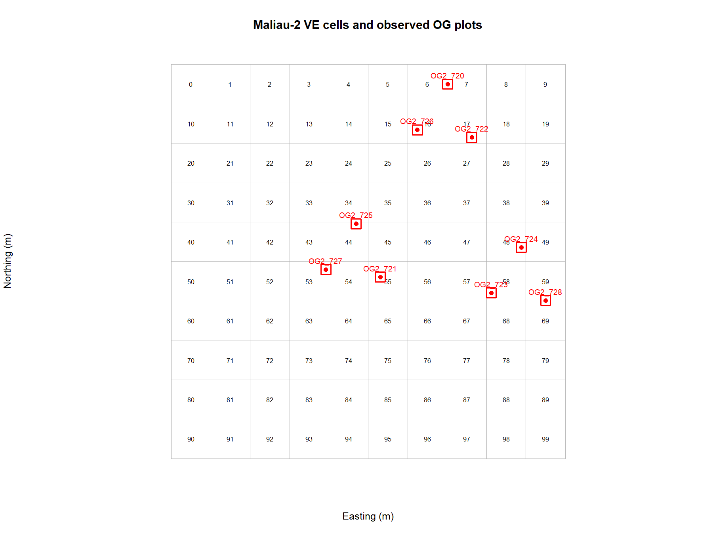

Each comparison row pairs one plot, one overlapping VE cell, and one census
date. A plot may overlap multiple cells, so its observed value is repeated and
those comparison rows are not independent. Each census date is matched to the
model timestep interval that contains it.

## Predicted Outputs

The processing script calculates total and PFT-specific stem and foliage carbon mass
for each cell and timestep, standardises the values to kg C ha-1, and writes
the full-grid output. The figures below show model dynamics before comparison
with observations.

### Mean Carbon Mass Across Cells

Each figure shows the mean mass per cell at each timestep. Values are in kg C ha-1.

#### Mean Stem Mass - all timesteps

Mean stem mass drops sharply during the initial timesteps.

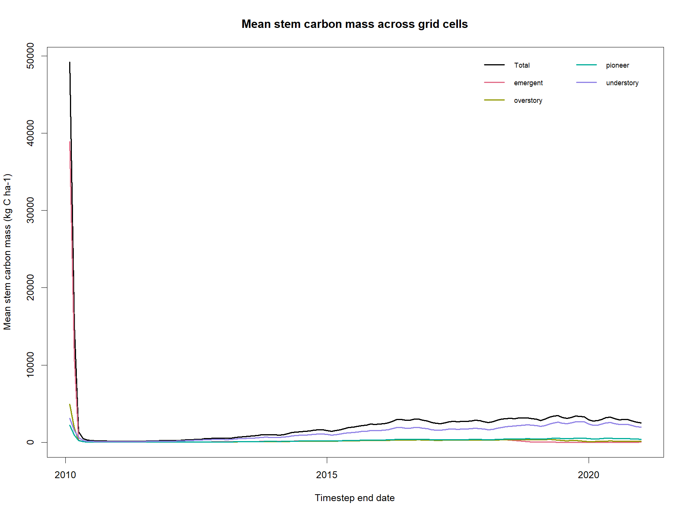

#### Mean Foliage Mass - all timesteps

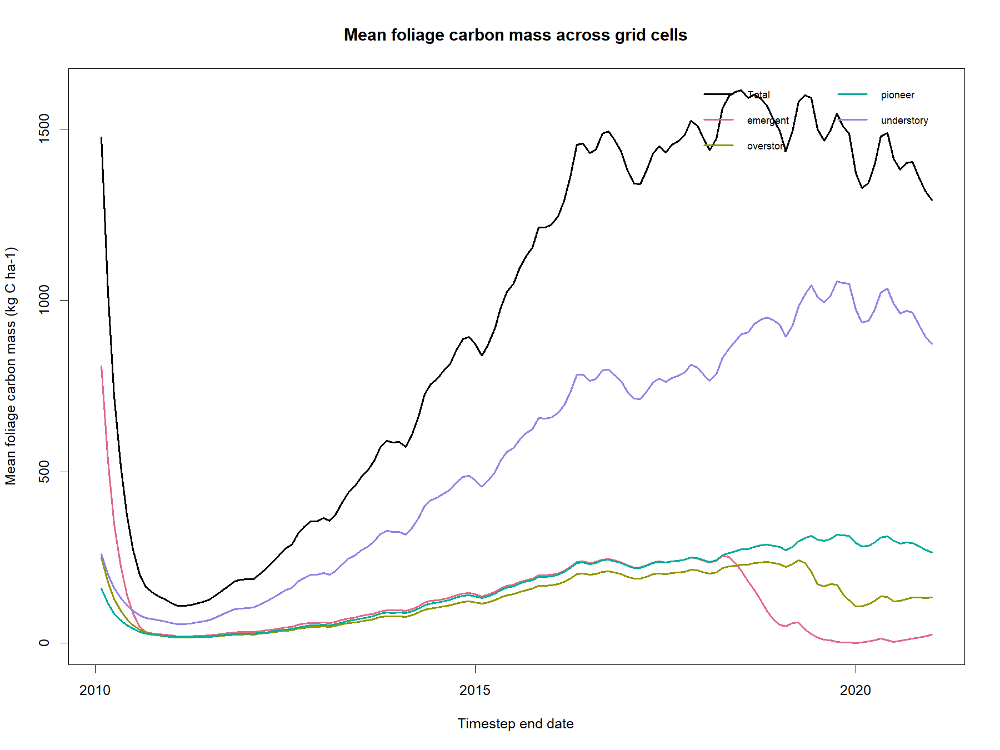

#### Mean Stem Mass - from timestep index 4 onwards

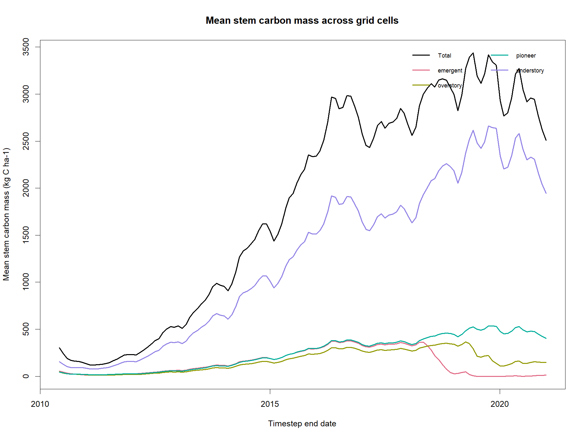

#### Mean Foliage Mass - from timestep index 4 onwards

The timestep index is zero-based, so index 4 is the fifth model timestep.

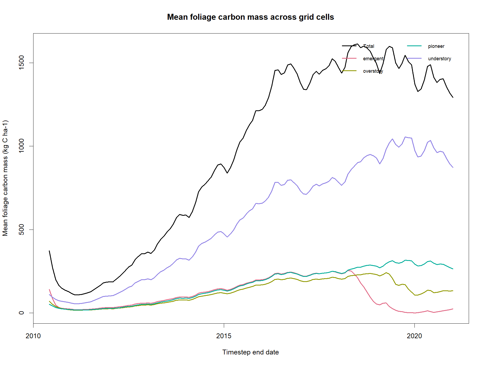

### PFT-Specific Cell Trajectories

These diagnostic figures show cell-level masses for every PFT across the full grid.

#### Stem PFT trajectories - all timesteps

Each line shows stem carbon mass in one grid cell for the panel's PFT.

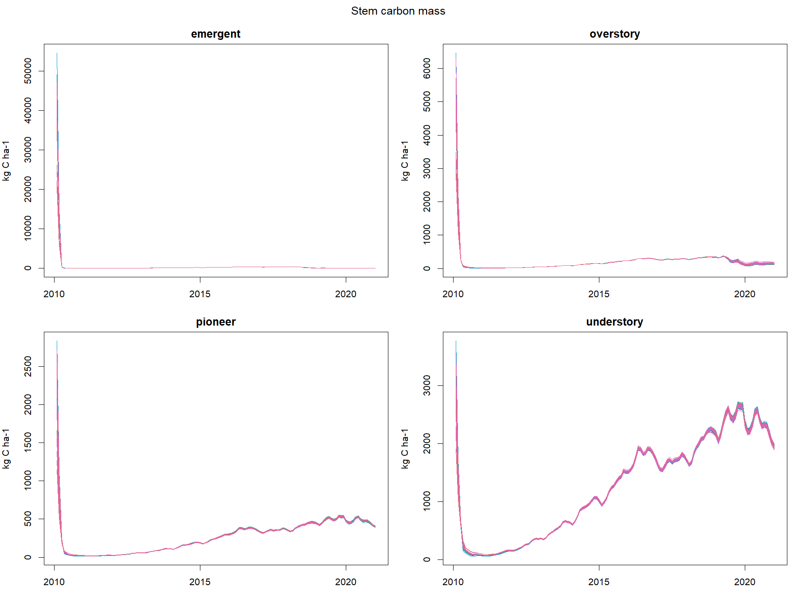

#### Foliage PFT trajectories - all timesteps

Each line shows foliage carbon mass in one grid cell for the panel's PFT.

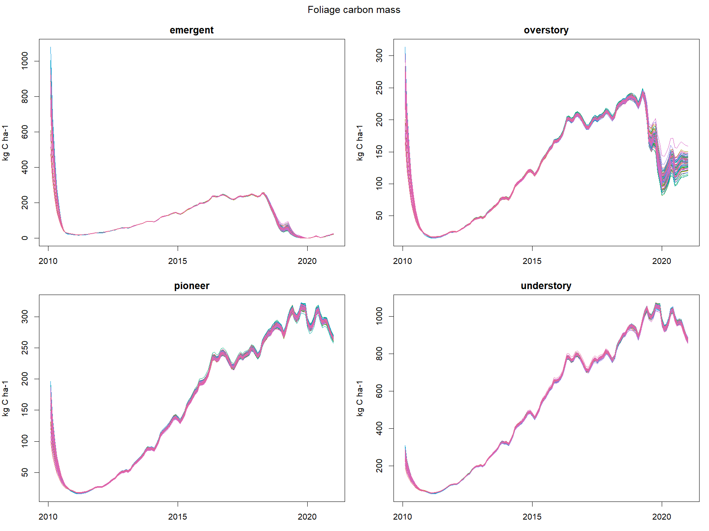

#### Stem PFT trajectories - from timestep index 4 onwards

Note the large unexpected difference between emergent and understory stem carbon mass.

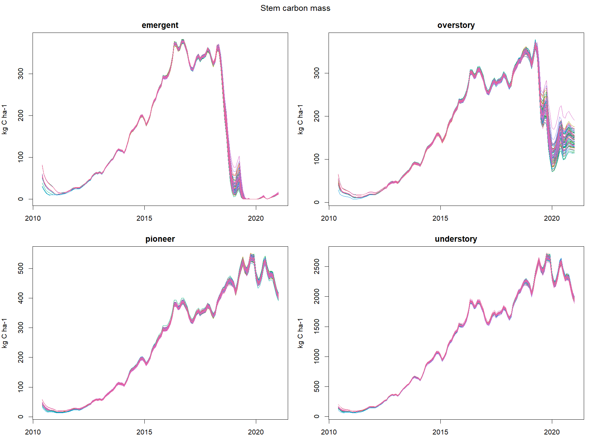

#### Foliage PFT trajectories - from timestep index 4 onwards

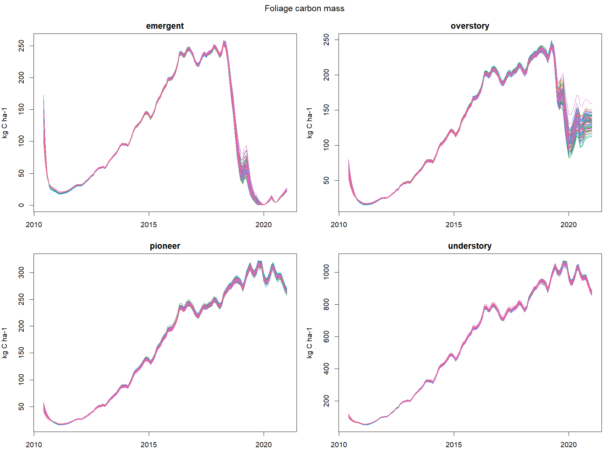

## Observed vs Modelled Comparisons

The figures show full-timestep trajectories only for VE cells that overlap the
observed plots. Black circles and triangles mark plot observations from the
2011 and 2014 censuses. Values are in kg C ha-1.

The curves provide time-series context; they are not restricted to census-date
timesteps. For the comparison table, each census date is matched to the model
timestep interval containing that date. A plot may overlap multiple cells, so
its observation is shown once in the figure but repeated across matched cells
in the table. Those table rows are not independent replicates.

The [Plant validation tracker](../plant_validation_tracker.md) summarises the
matched variables, periods, spatial and temporal extents, and units.

### Stem Comparison

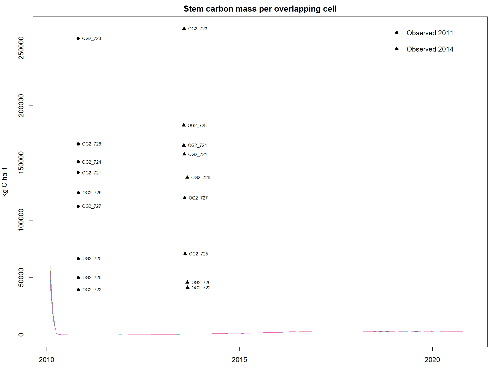

### Foliage Comparison

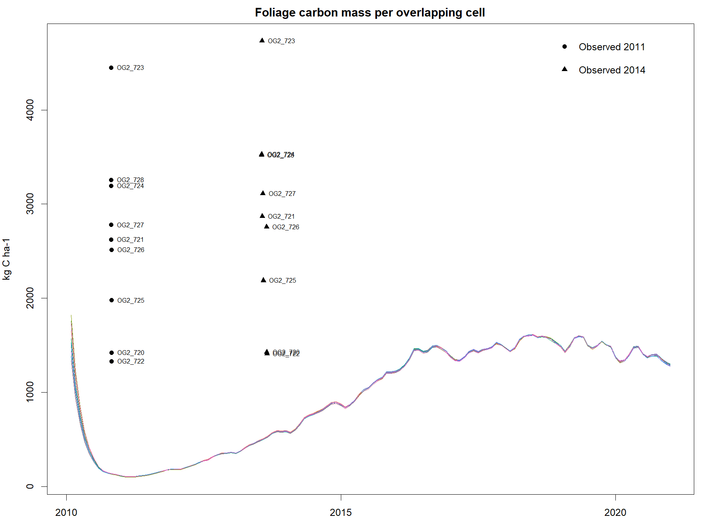

## Notes on the next steps in the validation process

The next steps in our planned validation process would be to plot observed vs
predicted for all the model outputs across models. However, there is room for
more targetted validation within models, and even within specific outputs. For
example, why/when are predicted outputs different from observed data, what's
driving the differences across PFTs, etc.?

Future validation could proceed in two stages. First, apply consistent spatial
and temporal matching to a prioritised set of outputs across Virtual Ecosystem
models. Then investigate selected discrepancies in greater depth, including
their magnitude, timing, early-simulation changes, and variation across cells
and PFTs. This staged approach provides broader coverage while reserving
detailed analysis for the most informative cases. Patterns across outputs may
also reveal shared causes.
