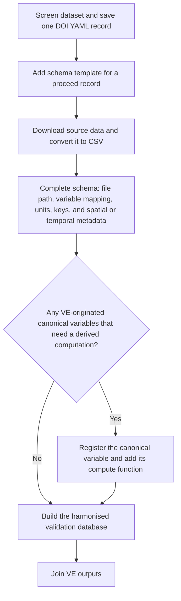
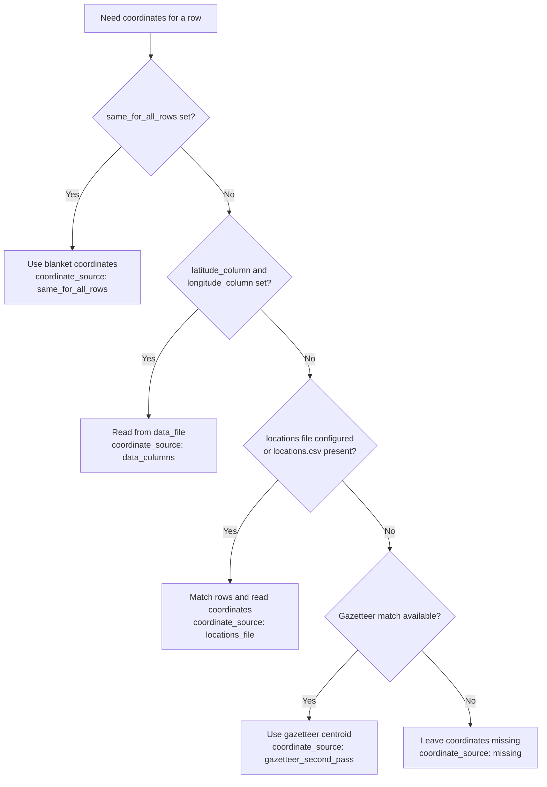
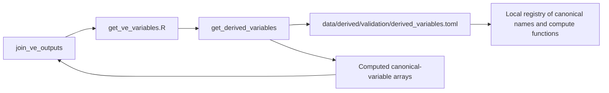

# Building a schema-based validation database

This workflow uses YAML metadata to read source datasets, harmonise them,
convert units, and combine them into one Parquet validation database.

## Workflow overview



## Folder structure and path conventions

Run commands from the repository root. The workflow expects these folders to
already exist; the functions below do not create them.

```text
data/primary/<module>/<author>_<year>/
└── <data sheet>.csv           # source data, converted manually or preprocessed
data/derived/<module>/validation/
├── sources/                   # one screening/schema YAML file per DOI
└── database/                  # output Parquet dataset
data/derived/validation/
└── derived_variables.toml     # VE-originated canonical variables with local compute functions (optional)
tools/R/R/valdb.R              # workflow functions
```

## How to load the key functions

These functions work with both `box::use()` and `source()`.

With `box::use()`:

```r
box::use(tools/R/R/valdb)
```

With `source()`:

```r
source("tools/R/R/valdb.R")
```

After `box::use()`, call exported functions as `valdb$function_name()`.
After `source()`, call them as `function_name()`. If you call
`join_ve_outputs()` after `source()`, also source
`tools/R/R/get_ve_variables.R` so VE variable readers are available.

## 1) Data screening

Use `screen_dataset()` to get DOI metadata and record whether a dataset should
proceed, be excluded, or be deferred.

```r
box::use(tools/R/R/valdb)

# setup path names
module_name <- "soil"
validation_root <- here::here(
  "data", "derived", module_name, "validation"
)
variables_derived <- here::here(
  "data", "derived", "validation", "derived_variables.toml"
)
sources_dir <- file.path(validation_root, "sources")
db_path <- file.path(validation_root, "database")

# run the screening function
valdb$screen_dataset(sources_dir = sources_dir)
```

The function asks for a DOI, a decision, a reason for the decision, and notes.
The available decisions are:

| Decision | Meaning |
| --- | --- |
| `proceed` | The source contains relevant validation data. |
| `exclude` | The source is unsuitable for the validation database. |
| `defer` | A decision requires more information or another opinion. |

Notes are required for `defer` decisions and when the selected reason is
`other`. DOI metadata must resolve through DOI content negotiation
(`rcrossref::cr_cn()`).

Each successful screening creates one file under `sources_dir`. The filename is
a stable ID automatically derived from the DOI, for example:

```text
doi-10-5281-zenodo-2024580.yaml
```

Existing DOI records are not overwritten. To amend a screening decision,
delete its per-DOI YAML file and screen the dataset again.

## 2) Add a schema template for a `proceed` DOI record

Use `add_schema()` only for a DOI record with
`screening.decision: proceed`.

`add_schema()` finds a screening record by DOI and adds one nested dataset
template under `datasets:` for the current build step.

```r
valdb$add_schema(
  doi = "10.5281/zenodo.2024580",
  sources_dir = sources_dir
)
```

The DOI can use upper-case characters, a `doi:` prefix, or a DOI resolver URL.
The code normalises it before lookup. The record must already exist. The record
must have `screening.decision: proceed`. The record must not already contain a
schema. If these conditions pass, the template is written safely. Then only the
target per-DOI YAML file opens for manual editing. Existing schemas are not
overwritten.

The initial template always uses the nested `datasets` layout, even when the
DOI record currently contains only one dataset.

## 3) Download the dataset and convert it to CSV

Download the dataset to `data/primary/<module>/<author>_<year>`. The soil
folder is an example on this page, and `author_year` is a folder naming
convention. If names conflict, name the next folder `author_year_2`. Continue in
that pattern.

Use CSV files. If the published dataset is in another format, such as Excel or
zip, manually convert the required data sheet into a CSV file. The workflow does
not support multiple file formats because manual conversion is still a small
cost.

Keep any location or coordinate files that come with the source dataset. For
the default spatial workflow, export the source location table as
`locations.csv` beside the measurement CSV.

## 4) Complete schema fields manually

The template is an editable scaffold, not a build-ready configuration. Replace
every placeholder with values from the source dataset. Remove unused example
entries. Add one `variables` entry for each source column to include.

This step also determines how later VE joins will behave. If
`variables.<source_column>.var_canonical` points to a standard VE canonical
variable, the join can use the existing VE variable metadata. If it points to a
canonical variable that is available only through local derived-variable
support, the schema alone is not enough. You must also add a registry entry for
that canonical variable in
[data/derived/validation/derived_variables.toml](data/derived/validation/derived_variables.toml)
and implement its reader in
[tools/R/R/get_ve_variables.R](tools/R/R/get_ve_variables.R). See
[Registry for VE-originated canonical variables with derived computation](#5-registry-for-ve-originated-canonical-variables-with-derived-computation).

For each dataset entry under `datasets:`, complete:

- `source_id` (e.g. `dobert_2019`)
- `data_file` (path to the CSV file)
- `skip_rows`
- `variables` (original name, canonical name, original unit)
- `dedup_key`

Dataset-specific fields are nested under `datasets`. Record-level fields stay
at the top level.

Example with one dataset:

```yaml
schema_version: 1
record_id: doi-10-5281-zenodo-2024580
doi: 10.5281/zenodo.2024580
screening:
  decision: proceed
  reason: relevant_validation_data
  notes: ""
  screened_at: "2026-08-13T12:05:00Z"
metadata:
  title: Example dataset
  authors:
    - Doe, Jane
  year: 2019
datasets:
  - source_id: dobert_2019
    data_file: data/primary/soil/dobert_2019/DoebertTF_SAFE_PlotData.csv
    skip_rows: 9
    variables:
      soilN:
        var_canonical: total_soil_n_per_volume
        unit: mg cm^-3
        description: Total soil nitrogen content
      soilP:
        var_canonical: dissolved_phosphorus
        unit: ug cm^-3
        description: Plant available soil phosphorus content
    dedup_key:
      - plot.code
```

To add another dataset from the same DOI, append another entry under
`datasets:` in the same YAML file. The build pipeline still uses one flat source
schema per dataset internally, keyed by unique `source_id`.

Assumptions and expectations

- Input files are CSV (`readr::read_csv()` is used internally).
- Known `var_canonical` names resolve against the latest VE
  canonical-variable metadata in `data_variables.toml` from the `develop`
  branch and, when supplied, the local derived-variable registry in
  `data/derived/validation/derived_variables.toml`.
- Source and canonical units are interpreted and converted with the `units`
  package. Malformed or dimensionally incompatible units are errors.
- Unknown canonical names produce a warning. Their observations and original
  units stay in the database. Canonical values and units are recorded as
  missing.

### Spatial and temporal metadata

The `coordinates` and `temporal` blocks are optional. Leave the template
values blank when the source does not provide that metadata. Missing spatial or
temporal metadata produces a warning. It also adds typed missing values in the
database. It does not make a complete schema a draft.

#### Coordinate sources and precedence

The builder fills coordinates in this order:



Each method sets a `coordinate_source` field that shows the source used:

1. **Blanket coordinates** (`same_for_all_rows`): Use when one location applies
   to the entire dataset. Set both `same_for_all_rows.latitude` and
   `same_for_all_rows.longitude` to scalar values in WGS84 decimal degrees.
   Rows filled this way have `coordinate_source: same_for_all_rows`.

2. **Data-column coordinates** (`latitude_column`, `longitude_column`): Use when
   the source CSV contains separate latitude and longitude columns. Set both
   `latitude_column` and `longitude_column` to the original column names.
   The builder reads these columns directly from `data_file`, converts them to
   numeric WGS84 decimal degrees, and flags rows as
   `coordinate_source: data_columns`. Missing coordinate values are retained
   and marked as `missing`. If one or both coordinate columns are not
   configured, the builder falls back to the locations-file workflow.

3. **External locations file** (`from_file`, `match_data_column`,
   `match_location_column`, `latitude_column`, `longitude_column`): Use when
   coordinates are stored in a separate file. By default, the builder looks for
   `locations.csv` beside `data_file`. To use another file, set `from_file`.
   Match the data with `match_data_column` from `data_file` and
   `match_location_column` from the locations file. Read latitude and longitude
   from `latitude_column` and `longitude_column` in the locations file. The
default names are `Latitude` and `Longitude`. A multi-column `dedup_key`
   requires an explicit `match_data_column`. Rows filled this way have
   `coordinate_source: locations_file`.

4. **Gazetteer second pass**: If rows still lack coordinates after the other
   methods, the builder matches the location key against
   `data/primary/site/gazetteer.geojson`. It fills missing coordinates from the
   centroid values (`centroid_x`, `centroid_y`). Rows filled this way are
   flagged as `coordinate_source: gazetteer_second_pass`.

All coordinate values must be WGS84 decimal degrees. The builder does not
accept invalid coordinates. Non-numeric or out-of-range values abort the build.
Rows with missing coordinates are flagged as `coordinate_source: missing`.

Temporal metadata can come from one `date_column`, from paired `start_column`
and `end_column` values, or from `same_for_all_rows.start` and
`same_for_all_rows.end`. Columns used for time metadata must also be retained by
`dedup_key` or `variables`. Optional `format`, `timezone`, and `precision`
settings control parsing. Supported precision values are `second`, `day`,
`month`, and `year`. Times are stored in UTC as half-open intervals
`[time_start, time_end)`. Source end values use the last inclusive precision
unit. `same_for_all_rows.end: open` means that the end has no limit. The
optional blanket `note` is stored in `time_note`.

#### Example: Coordinates from data columns

```yaml
coordinates:
  latitude_column: Latitude
  longitude_column: Longitude
```

The builder reads `Latitude` and `Longitude` directly from the source CSV
(`data_file`). It converts them to numeric WGS84 values.

#### Example: Blanket coordinates

```yaml
coordinates:
  same_for_all_rows:
    latitude: 4.3975
    longitude: 117.3659
```

All rows receive this single coordinate pair. The location is constant across
the dataset.

#### Example: External locations file (default)

```yaml
coordinates:
  match_data_column: plot.code
  match_location_column: Location name
  latitude_column: Latitude
  longitude_column: Longitude
```

The builder looks for `locations.csv` beside `data_file`. It matches
`plot.code` from the data against `Location name` in the locations file. It
reads coordinates from the `Latitude` and `Longitude` columns in the locations
file. If the locations file has missing coordinates for some matches, those rows
are kept and marked as `missing`.

#### Example: External locations file (custom path)

```yaml
coordinates:
  from_file: data/primary/soil/dobert_2019/sites.csv
  match_data_column: plot.code
  match_location_column: site_id
  latitude_column: lat
  longitude_column: lon
```

The builder reads coordinates from the specified `from_file` path. It matches
column names as configured. If the locations file contains duplicated keys, the
build aborts. It does not inflate the number of observations.

#### Temporal metadata

Temporal metadata can come from one `date_column`, from paired `start_column`
and `end_column` values, or from `same_for_all_rows.start` and
`same_for_all_rows.end`. Columns used for time metadata must also be retained by
`dedup_key` or `variables`. Optional `format`, `timezone`, and `precision`
settings control parsing. Supported precision values are `second`, `day`,
`month`, and `year`. Times are stored in UTC as half-open intervals
`[time_start, time_end)`. Source end values use the last inclusive precision
unit. `same_for_all_rows.end: open` means that the end has no limit. The
optional blanket `note` is stored in `time_note`.

For example:

```yaml
temporal:
  date_column:
  start_column:
  end_column:
  format:
  timezone: UTC
  precision: day
  same_for_all_rows:
    start: 2011-01-01
    end: 2014-12-31
    precision: day
    note: Sampling period reported by the source
```

Use either per-row settings or `same_for_all_rows` within each block. Remove
unused entries when the schema is complete.

## 5) Registry for VE-originated canonical variables with derived computation

`valdb` depends on `get_ve_variables.R` when it joins VE outputs to the
validation database. That file provides `get_data_variables()` and
`get_derived_variables()`. The second function reads the VE configuration TOML
file, computes VE-originated canonical variables that are not stored directly in
VE outputs, and returns them in the same named-list shape as the direct VE
variables.

The dependency chain is:



The shared TOML file is the local registry for VE-originated canonical
variables that are computed from VE outputs rather than stored directly in them.
Each entry links one canonical variable name to the R function that computes it.
When `join_ve_outputs()` sees one of those names, it can request the computed
canonical value instead of only looking for a variable stored directly in the VE
output files.

The current file lives at
[data/derived/validation/derived_variables.toml](data/derived/validation/derived_variables.toml).
Its entries follow this shape:

```toml
[[variable]]
name = "total_soil_n_per_volume"
description = "Total soil nitrogen per volume"
unit = "kg{N} m^-3"
function = "get_total_soil_n_per_volume"
```

For example, suppose you want to add a new VE-originated canonical variable
named `soil_n_pool_urea_per_mass`, where the VE value must be derived from other
VE outputs. The end-to-end change would look like this:

1. Add a new `[[variable]]` block to
   [data/derived/validation/derived_variables.toml](data/derived/validation/derived_variables.toml):

   ```toml
   [[variable]]
   name = "soil_n_pool_urea_per_mass"
   description = "Mass-basis soil urea nitrogen pool"
   unit = "kg{N} kg^-1"
   function = "get_soil_n_pool_urea_per_mass"
   ```

2. Add the matching R function to
   [tools/R/R/get_ve_variables.R](tools/R/R/get_ve_variables.R). The function
   should read the raw VE inputs it needs, compute one array, and return it with
   the expected VE dimensions.

Use the exact same `name` in both places, and make `function` point to a
function that returns one array with the expected VE dimensions. If the new
variable needs configuration values from the VE TOML file, pass them through the
helper function that computes it.

Update [build_validation_database()](tools/R/R/valdb.R) when the new canonical
variable should be accepted in validation schemas. Update `join_ve_outputs()`
when that canonical variable must be computed from VE output files during
scenario joins. In practice, the TOML registry and the R helper in
`get_ve_variables.R` are what `join_ve_outputs()` uses; the build step only uses
the derived-variable table to recognise and validate canonical names.

## 6) Build the validation database

Run:

```r
valdb$build_validation_database(
  variables_derived = variables_derived,
  sources_dir = sources_dir,
  db_path = db_path
)
```

Build behaviour

- Loads current canonical variable metadata from the VE `develop` branch.
- Combines it with local metadata for VE-originated canonical variables that
  use a derived computation path when that table is supplied.
- Converts known variables between compatible units with `units`.
- Reads per-DOI records from `sources_dir` in sorted filename order.
- Flattens each record to one build source per dataset entry under `datasets`.
- Ignores screening-only records.
- Warns about dataset entries that still contain mandatory placeholders, then
  skips them.
- Requires every schema record to retain a `proceed` screening decision.
- Writes Parquet output to `db_path`.

A `proceed` decision alone does not make a record build-ready. The builder uses
only completed dataset entries. It stops if no completed dataset schemas remain
after screening-only and draft entries are excluded.

## 7) Combine the validation database with VE outputs

Use
[analysis/soil/validation/combine_validation_database.R](analysis/soil/validation/combine_validation_database.R)
as a reference workflow.

```r
source("analysis/soil/validation/combine_validation_database.R")

combine_validation_database(
  module_name = "soil",
  scenario_group = "maliau",
  scenario_name = "maliau_2"
)
```

The wrapper derives standard repository paths from the module and scenario.
Supply `zarr_path`, `config_path`, `db_path`, or `combined_db_path` when files
are stored outside that layout.

`join_ve_outputs()` takes the validation database and VE scenario outputs from a
Zarr store. It joins the spatiotemporally aggregated VE outputs for each row. It
reads VE variables that are stored directly in the outputs and VE-originated
canonical variables that are computed from those outputs. It classifies each
observation by spatial and temporal overlap with the scenario bounds. It returns
three added columns: the lower quantile `value_VE_q05`, the median
`value_VE_q50`, and the upper quantile `value_VE_q95`.

Current implementation supports

- full spatial and temporal matching (`spatial_within_temporal_within`)
- temporal-only matching for observations outside VE spatial bounds
  (`spatial_outside_temporal_within`)

Other spatiotemporal classes return `NA` quantiles with a warning.

## Legacy screening records

The report source at
`analysis/soil/validation/safe_database_screen/dataset_screening.qmd` has been
retired. It reads the legacy aggregate format. Its generated HTML is a
historical snapshot. Do not treat it as current workflow output.

## Ongoing metadata curation

When new VE-originated canonical variables need a local derived computation
path, edit `data/derived/validation/derived_variables.toml`. Source schemas
should use unit strings that the `units` package understands.

## Notes for users

- Keep schema edits small.
- Commit frequently.
- Prefer explicit relative paths from the repository root.
