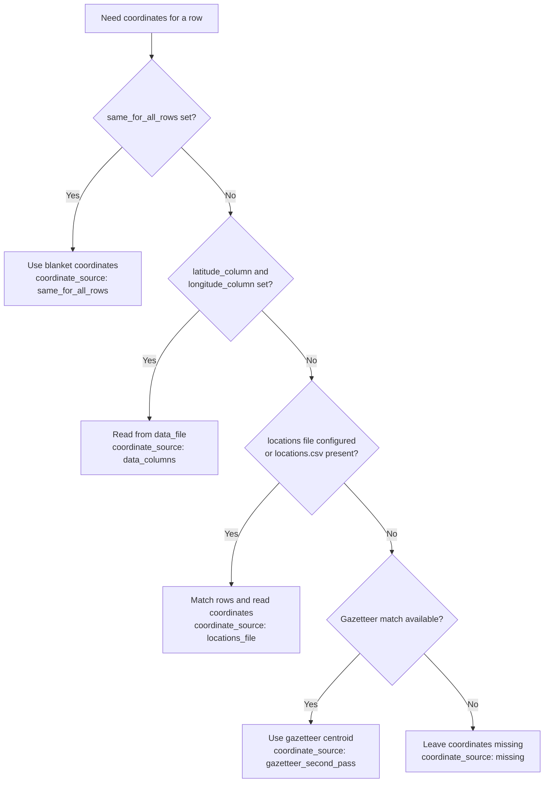
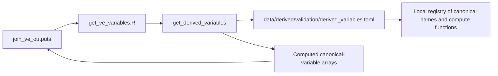

# Build a schema-based validation database

This workflow uses YAML metadata to read source datasets, convert units, and
combine the data into one Parquet validation database.

## Workflow overview

```mermaid
flowchart TD
  A[screen_dataset()\nScreen dataset and save one DOI YAML record] --> B[add_schema()\nAdd schema template for a \"proceed\" record]
  B --> C[Download source data and convert it to CSV]
  C --> D[Complete schema: file path, variable mapping, units, keys, and spatial or temporal metadata]
  D --> E{Any VE-originated canonical variables that need a derived computation?}
  E -- No --> F[build_validation_database()\nBuild the harmonised validation database]
  E -- Yes --> G[get_ve_variables.R\nRegister the canonical variable and add its compute function]
  G --> F
  F --> H[join_ve_outputs()\nJoin VE outputs]
```

## Folder structure and path conventions

!!! note
    Run commands from the repository root. The workflow expects these folders to

```text
exist. The functions below do not create them.
```

```text
ve_data_science/
├── data/derived/<module>/validation/sources/      # Step 1: one screening/schema YAML file per DOI
│   └── <doi>.yaml                                 # screening/schema YAML file
├── data/<primary or derived>/<module>/<author>_<year>/  # Step 2: source data, converted manually or preprocessed
│   └── <data sheet>.csv                           # source data file
├── data/derived/validation/                       # Step 5: VE-originated canonical variables with local compute functions
│   └── derived_variables.toml                     # derived-variable registry
├── data/derived/<module>/validation/database/     # Step 6: output Parquet dataset
│   └── <validation database>.parquet              # validation database
└── tools/R/R/valdb.R                              # workflow functions
```

## How to load the key functions

These functions work with both `box::use()` and `source()`.

With `box::use()`:

```r
box::use(tools/R/R/valdb)
```

With `source()`:

```r
source("tools/R/R/valdb.R")
```

After `box::use()`, call exported functions as `valdb$function_name()`.
After `source()`, call them as `function_name()`. If you call
`join_ve_outputs()` after `source()`, also source
`tools/R/R/get_ve_variables.R` so VE variable readers are available.

## 1) Data screening

Use `screen_dataset()` to get DOI metadata and record whether a dataset should
proceed, be excluded, or be deferred.

```r
box::use(tools/R/R/valdb)

# setup path names
module_name <- "soil"
validation_root <- here::here(
  "data", "derived", module_name, "validation"
)
variables_derived <- here::here(
  "data", "derived", "validation", "derived_variables.toml"
)
sources_dir <- file.path(validation_root, "sources")
db_path <- file.path(validation_root, "database")

# run the screening function
valdb$screen_dataset(sources_dir = sources_dir)
```

The function asks for a DOI, a decision, a reason for the decision, and notes.
The available decisions are:

| Decision | Meaning |
| --- | --- |
| `proceed` | The source contains relevant validation data. |
| `exclude` | The source is unsuitable for the validation database. |
| `defer` | A decision requires more information or another opinion. |

Notes are required for `defer` decisions and when the selected reason is
`other`. DOI metadata must resolve through DOI content negotiation
(`rcrossref::cr_cn()`).

Each successful screening creates one file under `sources_dir`. The filename is
a stable ID automatically derived from the DOI, for example:

```text
doi-10-5281-zenodo-2024580.yaml
```

Existing DOI records are not overwritten. To change a screening decision,
delete the per-DOI YAML file. Then screen the dataset again.

## 2) Add a schema template for a `proceed` DOI record

Use `add_schema()` only for a DOI record with
`screening.decision: proceed`.

`add_schema()` finds a screening record YAML file from
[Step 1](#1-data-screening) by DOI and adds one nested dataset template under
`datasets:`.

```r
valdb$add_schema(
  doi = "10.5281/zenodo.2024580",
  sources_dir = sources_dir
)
```

The DOI can use upper-case characters, a `doi:` prefix, or a DOI resolver URL.
The code normalises it before lookup. The record must already exist. The record
must have `screening.decision: proceed`. The record must not already contain a
schema. If these checks pass, the code adds the template. Then it opens only
that YAML file for manual editing.

The initial template always uses the nested `datasets` layout, even when the
DOI record currently contains only one dataset. If a DOI record covers more than
one dataset, add one nested entry under `datasets:` for each dataset and fill in
its schema fields separately. For example:

```yaml
datasets:
  - source_id: "author_year"
    data_file: "path/to/file_1.csv"
  - source_id: "author_year_2"
    data_file: "path/to/file_2.csv"
```

## 3) Download the dataset and convert it to CSV

Download the dataset to `data/primary/<module>/<author>_<year>`. The soil
folder on this page is one example. `author_year` is the folder naming pattern.
If names conflict, use `author_year_2`. Continue in that pattern.

Use CSV files. If the published dataset uses another format, such as Excel or a
zip archive, convert the required data sheet to CSV. If the raw dataset needs
extra data wrangling, store the preprocessing script in
[analysis/validation/](analysis/validation/). Write the processed CSV to
[derived/](derived/) beside the other validation inputs.

!!! tip
    Keep any location or coordinate files that come with the source dataset.

```text
For the default spatial workflow, export the source location table as
`locations.csv` beside the measurement CSV.
```

## 4) Complete schema fields manually

The template is an editable scaffold. It is not build-ready. Replace every
placeholder with values from the source dataset. Remove unused example entries.
Add one `variables` entry for each source column that you want to keep.

This step also controls later VE joins. For each entry under `variables`, check
`var_canonical`. If a source column maps to a standard VE canonical variable,
the join can use the existing VE variable metadata.

If a source column maps to a canonical variable that is available only through
local derived-variable support, the schema alone is not enough. You must add a
registry entry for that canonical variable in
[data/derived/validation/derived_variables.toml](data/derived/validation/derived_variables.toml).
You must also implement its reader in
[tools/R/R/get_ve_variables.R](tools/R/R/get_ve_variables.R). See
[Step 5](#5-registry-for-ve-originated-canonical-variables-with-derived-computation).

For each dataset entry under `datasets:`, complete these **required** fields:

- `source_id` (for example, `dobert_2019`)
- `data_file` (path to the CSV file)
- `skip_rows` (use `0` when there are no non-data rows to skip)
- `variables` (original name, canonical name, original unit)
- `dedup_key`

`coordinates` and `temporal` are **optional blocks**. Use them when the dataset
includes spatial or temporal information that should be mapped into the
validation database. If you leave either block unused, remove the placeholder
entries rather than leaving partially completed values in place. If you omit the
`coordinates` or `temporal` blocks, the build still runs, but it warns and fills
the corresponding spatial or temporal fields in the output validation database
with `NA` values.

Example with one dataset, adapted from
`doi-10-5281-zenodo-2024580`:

```yaml
schema_version: 1
record_id: doi-10-5281-zenodo-2024580
doi: 10.5281/zenodo.2024580
screening:
  decision: proceed
  reason: relevant_validation_data
  notes: Contains soil nutrients, moisture, pH, bulk density etc.
  screened_at: "2026-08-14T02:33:27Z"
metadata:
  title: Landuse change and species invasion
  authors:
    - Döbert, Timm
    - Webber, Bruce L.
    - Sugau, John B.
    - Dickinson, Katherine J. M.
    - Didham, Raphael K.
  year: 2019
  publisher: Zenodo
  url: https://zenodo.org/record/2024580
  provider: doi_content_search
  retrieved_at: "2026-08-14T02:33:16Z"
datasets:
  - source_id: dobert_2019
    data_file: data/primary/soil/dobert_2019/DoebertTF_SAFE_PlotData.csv
    skip_rows: 9
    variables:
      soilN:
        var_canonical: total_soil_n_per_volume
        unit: mg cm^-3
        description: Total soil nitrogen content
      soilP:
        var_canonical: dissolved_phosphorus
        unit: ug cm^-3
        description: Plant available soil phosphorus content
    dedup_key: plot.code
    coordinates:
      from_file: data/primary/soil/dobert_2019/locations.csv
    temporal:
      format: "%d/%m/%Y"
      timezone: Asia/Kuching
      same_for_all_rows:
        start: 01/12/2011
        end: 31/03/2014
        precision: day
        note: Start and end dates specified in the Summary sheet of the original file.
```

`dedup_key` can be one source column name or several source column names. In
YAML, that means either one string such as `dedup_key: plot.code` or a list
such as:

```yaml
dedup_key:
  - site_id
  - sample_id
  - date
```

Together, those columns identify one observation. Use one column when one field
is already unique after import. Use several columns when uniqueness depends on a
combination such as site, sample, and date. The builder uses this key to check
for duplicate rows within a dataset.

To add another dataset from the same DOI, append another entry under
`datasets:` in the same YAML file. The build pipeline still uses one flat source
schema per dataset internally, keyed by unique `source_id`.

### Assumptions and expectations

- Datasets and location files are CSV. The code uses `readr::read_csv()`.
- Known `var_canonical` names resolve against the latest VE
  canonical-variable metadata in `data_variables.toml` from the `develop`
  branch and, when supplied, the local derived-variable registry in
  [data/derived/validation/derived_variables.toml](data/derived/validation/derived_variables.toml).
- Source and canonical units are interpreted and converted with the `units`
  package. Use unit strings that the `units` package can read. Malformed or
  dimensionally incompatible units are errors.
- Unknown canonical names produce a warning. Their observations and original
  units stay in the database. Canonical values and canonical units are missing.

### Spatial metadata

The builder fills coordinates in this order:


```mermaid
flowchart TD
  A[Need coordinates for a row] --> B{same_for_all_rows set?}
  B -- Yes --> C[Use blanket coordinates\ncoordinate_source: same_for_all_rows]
  B -- No --> D{latitude_column and\nlongitude_column set?}
  D -- Yes --> E[Read from data_file\ncoordinate_source: data_columns]
  D -- No --> F{locations file configured\nor locations.csv present?}
  F -- Yes --> G[Match rows and read coordinates\ncoordinate_source: locations_file]
  F -- No --> H{Gazetteer match available?}
  H -- Yes --> I[Use gazetteer centroid\ncoordinate_source: gazetteer_second_pass]
  H -- No --> J[Leave coordinates missing\ncoordinate_source: missing]
```

Each method sets `coordinate_source` to show which source the build used.

1. **Blanket coordinates** (`same_for_all_rows`): Use this method when one
   location applies to the whole dataset. Set both
   `same_for_all_rows.latitude` and `same_for_all_rows.longitude` to scalar
   values in WGS84 decimal degrees. Rows filled this way have
   `coordinate_source: same_for_all_rows`.

2. **Data-column coordinates** (`latitude_column`, `longitude_column`): Use this
   method when the source CSV contains latitude and longitude columns. Set both
   `latitude_column` and `longitude_column` to the original column names. The
   builder reads these columns directly from `data_file` and converts them to
   numeric WGS84 decimal degrees. Rows filled this way have
   `coordinate_source: data_columns`. Missing coordinate values are kept and
   marked as `missing`. If one or both coordinate columns are not configured,
   the builder falls back to the locations-file workflow.

3. **External locations file** (`from_file`, `match_data_column`,
   `match_location_column`, `latitude_column`, `longitude_column`): Use this
   method when coordinates are stored in a separate file. By default, the
   builder looks for `locations.csv` beside `data_file`. To use another file,
   set `from_file`. Match the data with `match_data_column` from `data_file`
   and `match_location_column` from the locations file. Read latitude and
   longitude from `latitude_column` and `longitude_column` in the locations
   file. The default names are `Latitude` and `Longitude`. A multi-column
   `dedup_key` requires an explicit `match_data_column`. Rows filled this way
   have `coordinate_source: locations_file`.

4. **Gazetteer second pass**: If rows still lack coordinates after the other
   methods, the builder matches the location key against
   `data/primary/site/gazetteer.geojson`. It fills missing coordinates from the
   centroid values (`centroid_x`, `centroid_y`). Rows filled this way have
   `coordinate_source: gazetteer_second_pass`.

!!! important
    All coordinate values must be WGS84 decimal degrees.

The builder does not accept invalid coordinates. Non-numeric or out-of-range
values stop the build. Rows with missing coordinates have
`coordinate_source: missing`.

### Temporal metadata

Temporal metadata can come from one `date_column`, from paired `start_column`
and `end_column` values, or from `same_for_all_rows.start` and
`same_for_all_rows.end`. Columns used for time metadata must also be kept by
`dedup_key` or `variables`. Optional `format`, `timezone`, and `precision`
settings control parsing. Supported precision values are `second`, `day`,
`month`, and `year`. Times are stored in UTC as half-open intervals
`[time_start, time_end)`. Source end values use the last inclusive precision
unit. `same_for_all_rows.end: open` means that the end has no limit. The
optional blanket `note` is stored in `time_note`.

#### Example: Coordinates from data columns

```yaml
coordinates:
  latitude_column: Latitude
  longitude_column: Longitude
```

The builder reads `Latitude` and `Longitude` directly from the source CSV
(`data_file`). It converts them to numeric WGS84 values.

#### Example: Blanket coordinates

```yaml
coordinates:
  same_for_all_rows:
    latitude: 4.3975
    longitude: 117.3659
```

All rows receive this single coordinate pair. The location is constant across
the dataset.

#### Example: External locations file (default)

```yaml
coordinates:
  match_data_column: plot.code
  match_location_column: Location name
  latitude_column: Latitude
  longitude_column: Longitude
```

The builder looks for `locations.csv` beside `data_file`. It matches
`plot.code` from the data against `Location name` in the locations file. It
reads coordinates from the `Latitude` and `Longitude` columns in the locations
file. If the locations file has missing coordinates for some matches, those rows
are kept and marked as `missing`.

#### Example: External locations file (custom path)

```yaml
coordinates:
  from_file: data/primary/soil/dobert_2019/sites.csv
  match_data_column: plot.code
  match_location_column: site_id
  latitude_column: lat
  longitude_column: lon
```

The builder reads coordinates from the specified `from_file` path. It matches
column names as configured. If the locations file contains duplicated keys, the
build aborts. It does not inflate the number of observations.

For example:

```yaml
temporal:
  date_column:
  start_column:
  end_column:
  format:
  timezone: UTC
  precision: day
  same_for_all_rows:
    start: 2011-01-01
    end: 2014-12-31
    precision: day
    note: Sampling period reported by the source
```

!!! note
    Use either per-row settings or `same_for_all_rows` in one temporal block.

```text
Do not mix them.
```

Remove unused inner entries when the schema is complete.

## 5) Registry for VE-originated canonical variables with derived computation

`join_ve_outputs()` depends on
[tools/R/R/get_ve_variables.R](tools/R/R/get_ve_variables.R). That file
provides `get_data_variables()` and `get_derived_variables()`. The second
function reads the VE configuration TOML file, computes VE-originated canonical
variables that are not stored directly in VE outputs, and returns them in the
same named-list shape as the direct VE variables.

The dependency chain is:


```mermaid
flowchart LR
  A[join_ve_outputs] --> B[get_ve_variables.R]
  B --> C[get_derived_variables]
  C --> D[data/derived/validation/derived_variables.toml]
  D --> E[Local registry of canonical names and compute functions]
  C --> F[Computed canonical-variable arrays]
  F --> A
```

The shared TOML file is the local registry for VE-originated canonical variables
that are computed from VE outputs rather than stored directly in them. Each
entry links one canonical variable name to the R function that computes it. If
you wrote a Python function, you still need an R wrapper via `reticulate()`.
When `join_ve_outputs()` sees one of those names, it can request the computed
canonical value instead of only looking for a variable stored directly in the VE
output files.

The current file lives at
[data/derived/validation/derived_variables.toml](data/derived/validation/derived_variables.toml).
Its entries follow this shape:

```toml
[[variable]]
name = "total_soil_n_per_volume"
description = "Total soil nitrogen per volume"
unit = "kg{N} m^-3"
function = "get_total_soil_n_per_volume"
```

For example, suppose you want to add a new VE-originated canonical variable
named `herbivore_density`. Its VE value must be derived from other VE outputs.
The end-to-end change looks like this:

1. Add a new `[[variable]]` block to
   [data/derived/validation/derived_variables.toml](data/derived/validation/derived_variables.toml):

   ```toml
   [[variable]]
   name = "herbivore_density"
   description = "Density of herbivore function group"
   unit = "km^-1"
   function = "get_herbivore_density"
   ```

2. Define the `get_herbivore_density()` R function in
   [tools/R/R/get_ve_variables.R](tools/R/R/get_ve_variables.R). The function
   must read the raw VE inputs it needs, compute the output in the right object
   class (for example, array or data frame), and return it with the expected VE
   dimensions.

!!! important
    Use the exact same `name` in both places: in the `name = ...` entry in

```text
[data/derived/validation/derived_variables.toml](data/derived/validation/derived_variables.toml)
and in the `var_canonical: ...` entry in the schema in
[Step 4](#4-complete-schema-fields-manually).
```

Update [Step 6](#6-build-the-validation-database) when the new canonical
variable must be accepted in validation schemas. Update
[Step 7](#7-combine-the-validation-database-with-ve-outputs) when that canonical
variable must be computed from VE output files during scenario joins. In
practice, `join_ve_outputs()` uses the TOML registry and the R helper in
`get_ve_variables.R`. The build step uses the derived-variable table only to
recognise and validate canonical names.

## 6) Build the validation database

After registering any VE-originated canonical variables, run:

```r
valdb$build_validation_database(
  variables_derived = variables_derived,
  sources_dir = sources_dir,
  db_path = db_path
)
```

This builds the validation database from the completed schemas in `sources_dir`
and writes one Parquet file per completed dataset entry to `db_path`.

!!! warning
    `db_path` is a local output directory, not a Git-tracked location in this

```text
repository. Parquet outputs are ignored by Git, so save them in your local
repo working copy and, when you need to share or publish them, upload them
via Globus rather than committing them to the repository.
```

What the above code does:

- Loads current canonical variable metadata from the VE `develop` branch.
- Combines it with local metadata for VE-originated canonical variables that
  use a derived computation path when that table is supplied.
- Converts known variables between compatible units with `units`.
- Reads per-DOI records from `sources_dir` in sorted filename order.
- Flattens each record to one build source per dataset entry under `datasets`.
- Ignores screening-only records.
- Warns about dataset entries that still contain mandatory placeholders, then
  skips them.
- Requires every schema record to retain a `proceed` screening decision.
- Writes Parquet output to `db_path`.

!!! note
    A `proceed` decision alone does not make a record build-ready. The builder
    uses only completed dataset entries.

If no completed dataset schemas remain after screening-only and draft entries
are excluded, the build stops.

## 7) Combine the validation database with VE outputs

Use
[analysis/soil/validation/combine_validation_database.R](analysis/soil/validation/combine_validation_database.R)
as a reference workflow.

```r
source("analysis/soil/validation/combine_validation_database.R")

combine_validation_database(
  module_name = "soil",
  scenario_group = "maliau",
  scenario_name = "maliau_2"
)
```

The wrapper derives standard repository paths from the module and scenario.
Supply `zarr_path`, `config_path`, `db_path`, or `combined_db_path` when files
are stored outside that layout.

`join_ve_outputs()` takes the validation database and VE scenario outputs from a
Zarr store. It joins the spatiotemporally aggregated VE outputs to each row. It
reads VE variables that are stored directly in the outputs and VE-originated
canonical variables that are computed from those outputs. It classifies each
observation by spatial and temporal overlap with the scenario bounds. It returns
three added columns: the lower quantile `value_VE_q05`, the median
`value_VE_q50`, and the upper quantile `value_VE_q95`.

The current implementation supports:

- full spatial and temporal matching (`spatial_within_temporal_within`)
- temporal-only matching for observations outside VE spatial bounds
  (`spatial_outside_temporal_within`)

Other spatiotemporal classes return `NA` quantiles with a warning.

## Notes for users

- Keep schema edits small.
- Commit frequently.
- Prefer explicit relative paths from the repository root.
