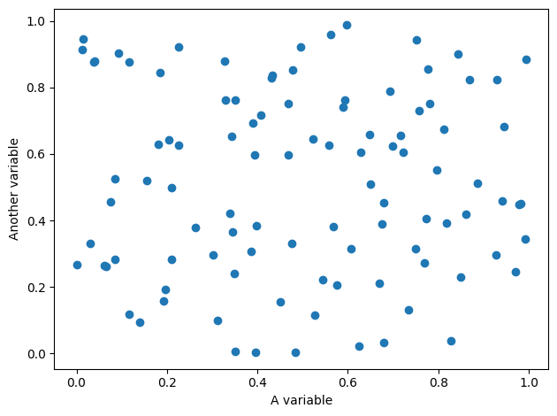

# Experimental notebook

This is an experimental notebook

```python
# This is a code cell
import matplotlib.pyplot as plt
import numpy as np
```

We're going to do some stuff

```python
x = np.random.uniform(size=100)
y = np.random.uniform(size=100)

plt.scatter(x, y)
plt.xlabel("A variable")
plt.ylabel("Another variable")
plt.tight_layout()
```


