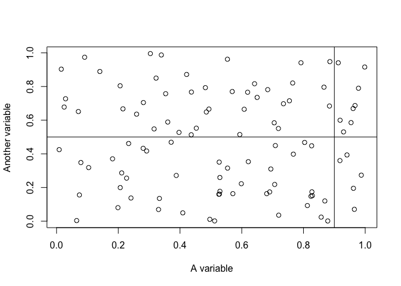

# Experimental notebook

This is an experimental notebook

``` r
# This is a code cell
library(MASS)
```

We’re going to do some stuff

``` r
x <- runif(100)
y <- runif(100)

plot(
    x, y,
    xlab = "A variable",
    ylab = "Another variable"
)

abline(h = 0.5, v = 0.9)
```



``` r
mean(x)
```

    [1] 0.5407535
