# VE hydrology: findings for every flow variable

## Environment and data provenance

**uv environment (pinned VE).** The runs and this analysis use the `dev-pinned`
dependency group in `pyproject.toml`:

| Item | Value |
| --- | --- |
| Install | `uv sync --group dev-pinned` |
| Virtual Ecosystem | `0.2.1`, git commit `22689f01a2460953865244f2d79f162a32ff2003` |
| SALib (sampling) | `1.5.2` |

**Data used: `maliau_2` site**

```toml
[Scenario.maliau_2]
# Site definition file for maliau_2
# Grid: 10 x 10 cells, resolution = 100 m
# Temporal: 2010-2020 (11 years)

epsg_code = 32650
ll_x = 496400
ll_y = 524100
ur_x = 497400
ur_y = 525100
```

**Static mode.** Every run starts from
`data/sensitivity/hydrology/config/static_hydro_configuration.toml`. Only the
hydrology module is updated through time; all other modules are run in static
mode, so their state stays fixed and the sensitivity reflects hydrology alone.

| Module | `static` |
| --- | --- |
| `hydrology` | `false` (sampled module) |
| `abiotic_simple` | `true` |
| `plants` | `true` |
| `animal` | `true` |
| `litter` | `true` |
| `soil` | `true` |

## Summary

The run completes and routes water correctly over the terrain, but the soil and
groundwater parts of the water balance are wrong. Three defects explain most of what
is seen in the flow variables below:

1. **Water is created in the groundwater stores.** Outflows (subsurface flow and
   baseflow) are calculated from the stores but never taken out of them, and a fixed
   loss drives the lower store below zero.
2. **Vertical flow between soil layers is almost zero.** A unit conversion error (a
   factor of 10⁶) and a drainage limit taken from the wrong layer keep the topsoil
   saturated and stop all recharge.
3. **River discharge is 30 times too small.** Each day's runoff is converted to a
   rate as if it had taken 30 days to flow.

| Flow variable | Status | Main issue |
| --- | --- | --- |
| precipitation_surface (throughfall) | OK | 86-88 % of precipitation, as observed |
| surface_runoff | Problem | 84 % of precipitation (about 5 % expected) |
| vertical_flow | Problem | About 1e-5 mm per day, zero from 2018 |
| subsurface_stormflow | Problem | Drains the initial subsoil water once, then stops |
| subsurface_flow | Problem | 2 589 mm in 2010, about 2 mm per year afterwards |
| bypass_flow | Problem | Small and declining, unrelated to precipitation |
| baseflow | Critical | 12 603 mm in 2010 (4.7 times precipitation), zero from 2014 |
| surface_runoff_routed_plus_local | OK (with note) | Follows terrain; outlets count their own runoff twice |
| subsurface_runoff_routed_plus_local | Problem | Dominated by created baseflow until 2013 |
| total_runoff | Problem | Falls from 130 924 to about 16 000 mm per year as created water runs out |
| river_discharge_rate | Problem | Exactly 30 times too small in every cell and month |

## How to read the flow-variable figures

Each figure has three parts:

- **Left:** the mean over 2010-2020 in each grid cell; orange crosses are the two
  drainage sinks (outlets), cells 18 and 10.
- **Top right:** domain-mean monthly precipitation (ERA5).
- **Bottom right:** the variable through time for every cell (light blue), the domain
  mean (dark blue) and the main sink, cell 18 (orange).

Routed variables, discharge and vertical flow use a log scale because they span
several orders of magnitude.

## Whole-domain problems

### Water balance

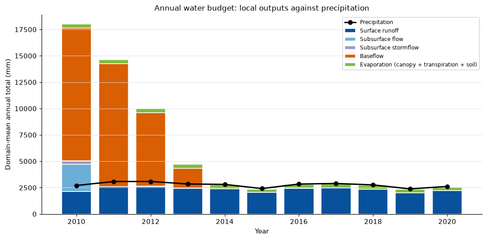

*Annual local outputs (bars) against precipitation (line). In 2010-2012 the outputs
are 6.7, 4.7 and 3.2 times the precipitation, almost all as baseflow. From 2014 the
outputs roughly equal precipitation only because baseflow has stopped.*

### Groundwater stores

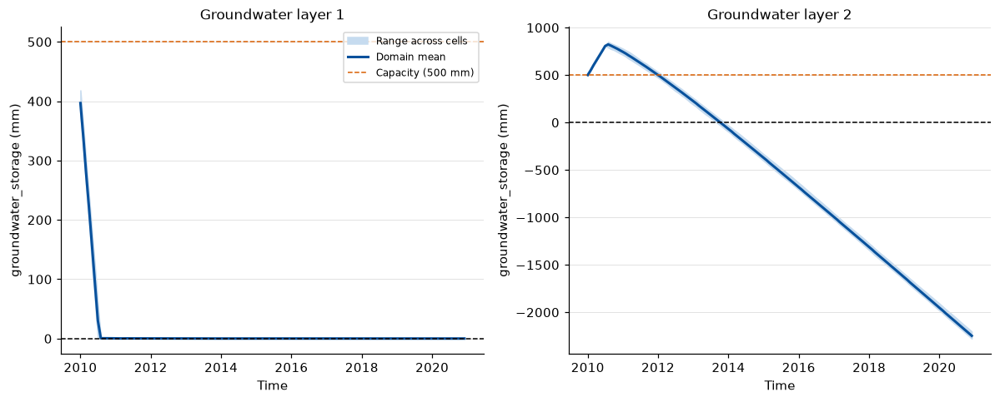

*The upper store empties in about six months; the lower store rises above its 500 mm
capacity, then falls below zero at the end of 2013 and reaches about -2 250 mm by
December 2020.*

- **Possible cause:** outflows are never removed from the stores, and a fixed loss of
  1 mm per day is removed even from an empty store with no floor at zero. Rerunning
  the groundwater function with this run's inputs reproduces the lower store to
  within 1 mm.

### Soil moisture

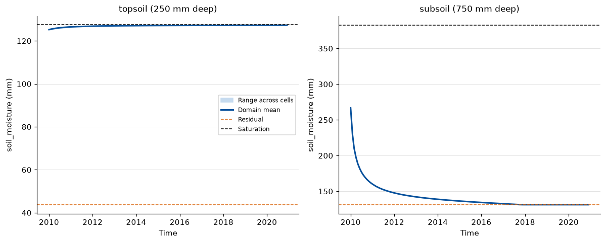

*The topsoil stays at saturation for the whole run; the subsoil drains to its
residual content by 2018 and is never refilled.*

- **Possible cause:** vertical flow is almost zero (see *vertical_flow* below).

## Flow variables

### precipitation_surface (throughfall)


- **What it shows:** 2 061-2 705 mm per year, 86-88 % of precipitation every year;
  follows precipitation month by month and is uniform across the grid.
- **Assessment:** realistic. Canopy interception loss (about 355 mm per year, 13 %)
  is close to the 11 % measured in unlogged Bornean forest.
- **Evidence:** interception loss was 11 % of gross rainfall in unlogged lowland
  forest in Central Kalimantan [1] and 209 mm per year at Lambir, Sarawak
  (2000-2009) [4].

### surface_runoff

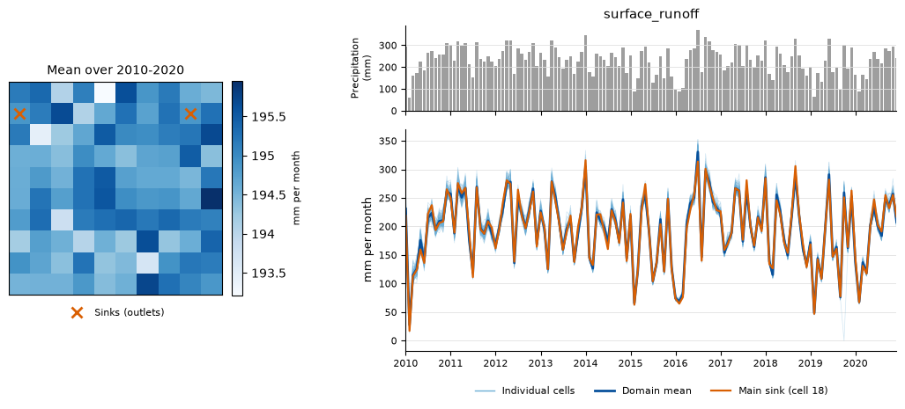

- **What it shows:** 2 022-2 618 mm per year, 84 % of precipitation and 97 % of
  throughfall; follows precipitation almost exactly and is uniform across the grid.
- **Problem:** far too high. Overland flow under undisturbed forest at Danum Valley is
  about 5 % of precipitation.
- **Evidence:** on an undisturbed control plot at Danum Valley, runoff was 153.7 mm
  from 3 354.7 mm of rainfall (4.6 %) [3]. Reviews of tropical forest hydrology find
  that the infiltration capacity of undisturbed forest soils is rarely exceeded, so
  overland flow is uncommon [2].
- **Possible cause:** the topsoil is saturated for the whole run because vertical
  flow is almost zero, so almost all throughfall becomes saturation-excess runoff.

### vertical_flow

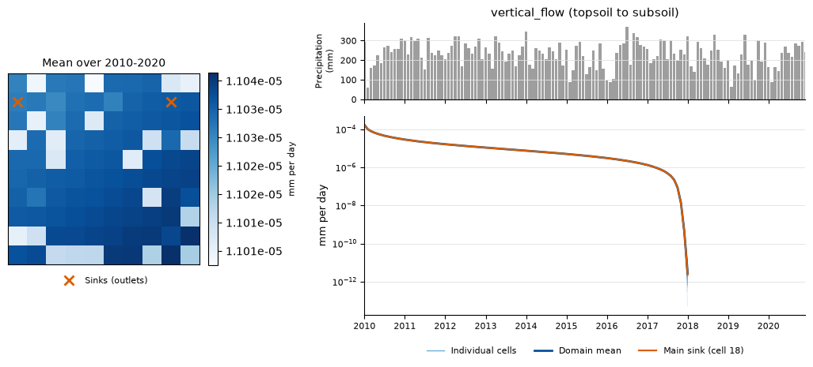

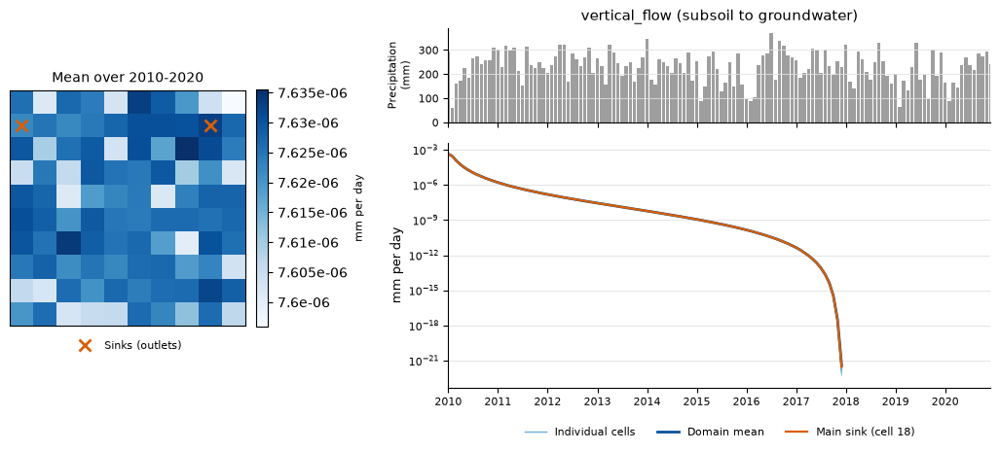

- **What it shows:** from the topsoil, about 1e-5 mm per day on average (at most
  1.7e-4); from the subsoil, about 8e-6 mm per day (at most 4.6e-4). Both fall
  steadily and stop in every cell in early 2018. At most 0.03 mm moves between the
  layers in a year.
- **Problem:** the soil physics for the run's near-saturated topsoil implies
  drainage of about 1 900 mm per day; the simulated flux is about 10⁸ times smaller.
- **Evidence:** measured saturated hydraulic conductivity on an undisturbed plot at
  Danum Valley is 0.22-2.54 cm per hour (about 53-610 mm per day) [3]. Even the
  lowest field value is millions of times larger than the simulated flux. The
  configured value (12.6 cm per hour) is 5-57 times the field range.
- **Possible cause:** the flux is converted from metres to millimetres by dividing by
  1000 instead of multiplying (a factor of 10⁶), and the amount allowed to leave a
  layer is capped by the water in the layer below. When the subsoil reaches its
  residual content in 2018, that cap becomes zero and all flow stops.

### subsurface_stormflow

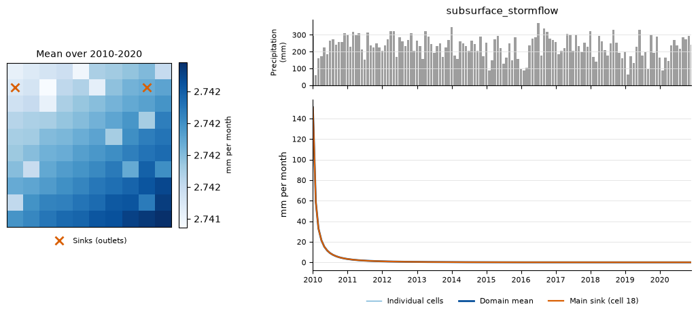

- **What it shows:** 326 mm in 2010, then 22, 8 and 4 mm in 2011-2013, and zero from
  2018.
- **Problem:** it only drains the water the subsoil held at the start of the run and
  does not respond to precipitation.
- **Possible cause:** the subsoil is never refilled because vertical flow is almost
  zero, so stormflow falls as the subsoil dries to its residual content.

### subsurface_flow

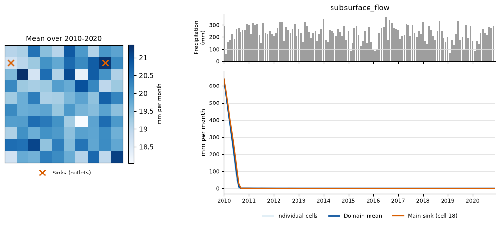

- **What it shows:** about 650 mm per month in January 2010, 2 589 mm over 2010,
  then 2-6 mm per year from 2011; no response to wet months.
- **Problem:** the 2010 pulse is not supported by recharge, and afterwards the flow
  is almost zero.
- **Possible cause:** subsurface flow is the outflow of the upper groundwater store
  but is never taken out of it, so the initial 450 mm is released repeatedly until
  percolation to the lower store empties it (about 170 days). Afterwards there is
  no recharge because vertical flow is almost zero.

### bypass_flow

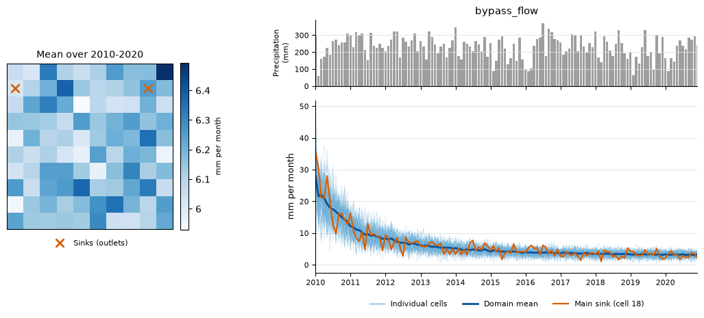

- **What it shows:** 223 mm in 2010, declining smoothly to about 39 mm per year by
  2019-2020; almost unrelated to precipitation.
- **Problem:** bypass flow should increase in wet periods, when the soil is wet.
- **Possible cause:** surface runoff is calculated first and removes almost all
  water from the saturated topsoil, leaving only the small deficit below saturation
  for infiltration and bypass flow. The decline follows that deficit, not
  precipitation.

### baseflow

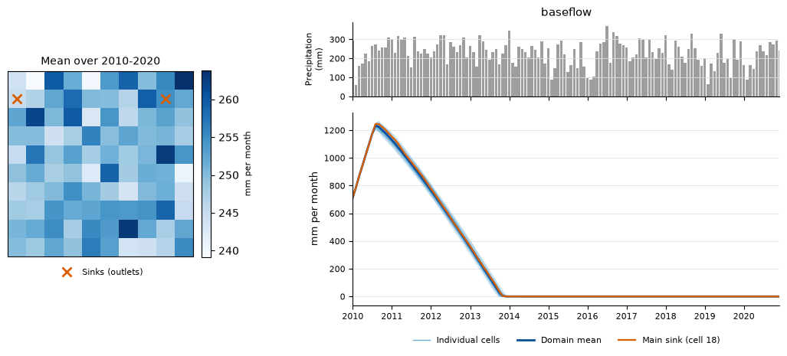

- **What it shows:** 12 603, 11 627, 6 970 and 1 922 mm in 2010-2013 (4.7, 3.8, 2.3
  and 0.7 times precipitation), a peak of about 1 250 mm per month in mid-2010, a
  straight-line decline, and zero in every cell from the end of 2013 (65 % of all
  values are zero).
- **Problem:** the 2010 baseflow alone is 25 times the groundwater capacity (500 mm).
  Forest catchments at Danum Valley and in the SAFE landscape have 753-1 877 mm of
  baseflow per year.
- **Evidence:** in five headwater catchments in Sabah (1.7-4.6 km²), annual baseflow
  was 1 877 mm in primary forest, 753-1 265 mm in logged or old-growth forest and
  367 mm under oil palm, with baseflow making up 38-68 % of streamflow [6]. The
  simulated 2010 value is 7-17 times the forest range; from 2014 it is below the
  oil palm value.
- **Possible cause:** baseflow is calculated as a twentieth of the lower store each
  day but never removed from it, so the store releases the same water again every
  day and declines only by the fixed 1 mm per day loss, which gives the straight
  line. Removing the outflow gives 521 mm in 2010 with the same inputs.

### surface_runoff_routed_plus_local

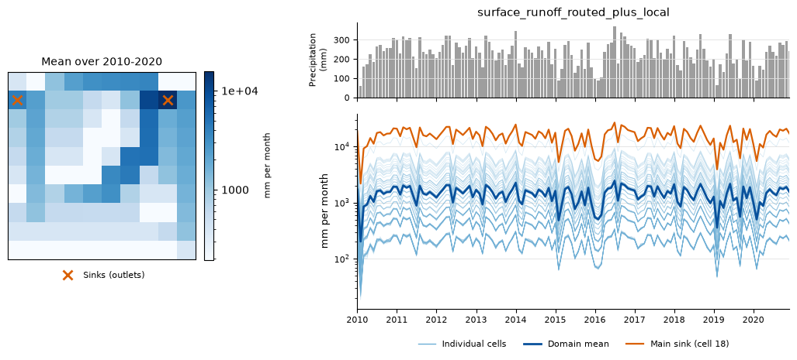

- **What it shows:** surface runoff accumulated along the drainage network; values
  rise towards the sinks. The main sink (cell 18, 79 cells draining in) receives
  81 % of the site's surface runoff and the second sink (cell 10, 19 cells) 21 %.
- **Assessment:** routing is connected and follows the terrain.
- **Problem:** the two shares add up to 102 %.
- **Possible cause:** a sink drains to itself, so it is listed as one of its own
  upstream cells and its runoff is added twice.

### subsurface_runoff_routed_plus_local

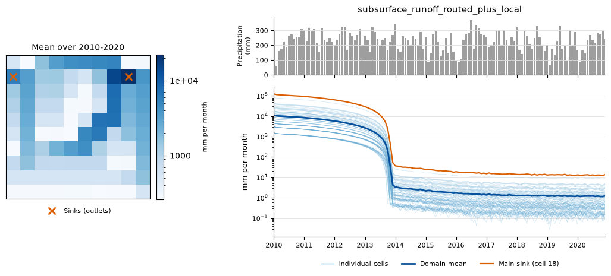

- **What it shows:** domain mean 115 142 mm in 2010, falling to about 14 mm per year
  by 2019-2020; at the main sink up to about 121 000 mm per month in 2010.
- **Problem:** no delayed, damped response to precipitation; the signal is the
  created baseflow draining away, then almost nothing.
- **Evidence:** in forest catchments in Sabah, baseflow makes up 42-68 % of
  streamflow [6]; the simulated subsurface contribution is about 88 % of local runoff
  in 2010 and close to zero from 2014.
- **Possible cause:** a consequence of the groundwater and vertical-flow defects.

### total_runoff

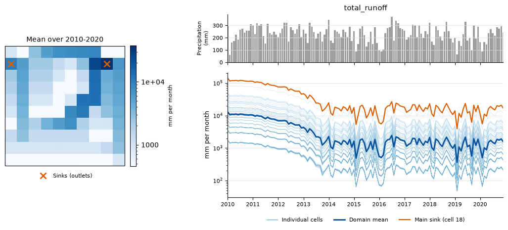

- **What it shows:** domain mean 130 924 mm in 2010, 105 653 in 2011 and 71 245 in
  2012, then 15 000-17 700 mm per year from 2014; about 38 000 mm per month on
  average at the main sink.
- **Problem:** the 2010-2013 decline is created baseflow running out, not a
  hydrological signal; only from 2014 does total runoff follow precipitation.
- **Note:** routed values are sums of upstream cell depths, not depths over the
  contributing area, so they cannot be compared directly with precipitation.
  Reporting them as volumes (m³) or as depths over the contributing area would help.

### river_discharge_rate

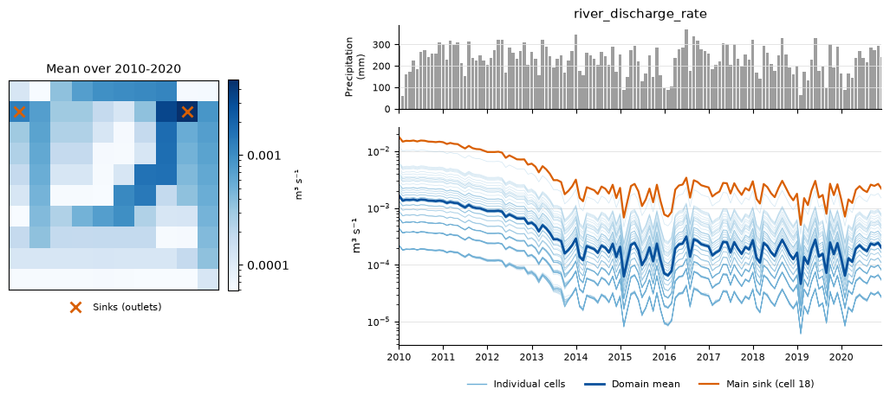

- **What it shows:** about 0.0049 m³ s⁻¹ at the main sink and 0.0013 m³ s⁻¹ at the
  second sink on average; same pattern as total_runoff.
- **Problem:** exactly 30 times smaller than the rate implied by total_runoff, in
  every cell and month. From 2014 the grid generates about 0.075 m³ s⁻¹ of runoff,
  but the two sinks report 0.0025 m³ s⁻¹.

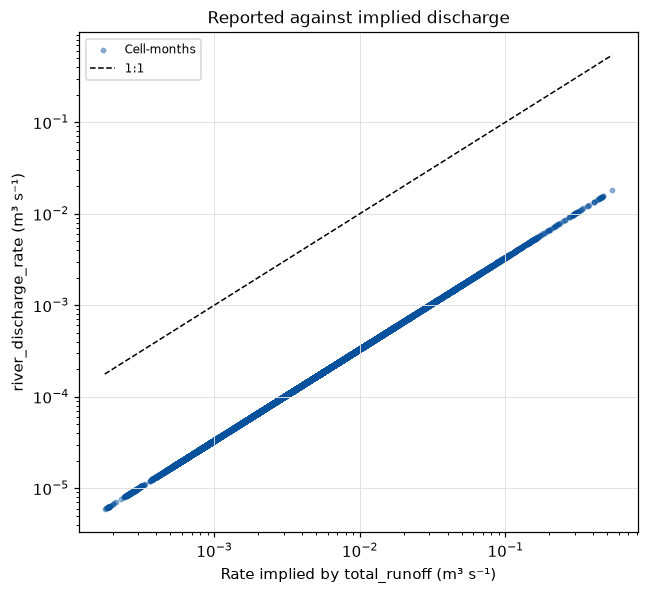

*Reported discharge against the discharge implied by total_runoff: all points lie on
a line parallel to 1:1, 30 times below it.*

- **Possible cause:** the model works through each month one day at a time and
  converts each day's runoff to a rate using the length of the whole month (30 days)
  instead of one day.

## Comparison with Bornean lowland forest

| Quantity | This run | Observed | Source |
| --- | --- | --- | --- |
| Precipitation (mm per year) | 2 767 | 2 870, Danum Valley (1985-2016); about 2 740, Miri near Lambir (1968-2001) | [6], [5] |
| Canopy interception | 13 % of precipitation, 355 mm per year | 11 %, Central Kalimantan; 209 mm per year, Lambir | [1], [4] |
| Transpiration (mm per year) | 3 | 1 114 (Lambir, 2000-2009); 1 193 (Lambir) | [4], [5] |
| Evapotranspiration (mm per year) | 358 | 1 323 (Lambir, 2000-2009); 1 545 (Lambir) | [4], [5] |
| Surface runoff | 84 % of precipitation | 4.6 %, undisturbed plot, Danum Valley | [3] |
| Baseflow (mm per year) | 12 603 in 2010; 0 from 2014 | 753-1 877, forest catchments, Danum Valley and SAFE | [6] |
| Baseflow share of streamflow | about 71 % in 2010; 0 from 2014 | 42-68 % in forest; 38 % under oil palm | [6] |
| Saturated hydraulic conductivity (cm per hour) | 12.6 (configured) | 0.22-2.54, undisturbed plot, Danum Valley | [3] |

## Supporting evidence from the literature

The published values come from sites near Maliau (Danum Valley and the SAFE
landscape in Sabah, Lambir in Sarawak) or from comparable lowland dipterocarp forest
(Central Kalimantan). They differ from this run in scale and method, so they show
the expected order of magnitude, not calibration targets.

| # | Study | Site and method | Values used here | Supports |
| --- | --- | --- | --- | --- |
| [1] | Asdak et al. (1998) | Unlogged and logged lowland forest, Central Kalimantan; throughfall and stemflow on two 1 ha plots over 12 months | Interception loss 11 % of gross rainfall (unlogged), 6 % (logged) | Throughfall and interception in the run are realistic |
| [2] | Bruijnzeel (2004) | Review of tropical forest hydrology | Infiltration capacity of undisturbed forest soils rarely exceeded; overland flow uncommon | Surface runoff of 84 % is unrealistic |
| [3] | Cleophas et al. (2017) | Selectively logged forest, Danum Valley, Sabah; runoff plots and infiltration measurements | Control plot runoff 153.7 mm from 3 354.7 mm rainfall (4.6 %); Ks 0.22-2.54 cm per hour | Surface runoff too high; vertical flow too low; configured Ks high |
| [4] | Kume et al. (2011) | Lambir Hills, Sarawak; big-leaf model checked against eddy covariance, throughfall and sap flow, 2000-2009 | Transpiration 1 114, interception 209, evapotranspiration 1 323 mm per year | Transpiration and evapotranspiration far too low |
| [5] | Kumagai et al. (2005) | Lambir Hills, Sarawak; annual water balance and seasonality of evapotranspiration | Transpiration 1 193, evapotranspiration 1 545 mm per year; rainfall about 2 740 mm per year | Transpiration and evapotranspiration far too low |
| [6] | Nainar et al. (2022) | Five headwater catchments (1.7-4.6 km²), Danum Valley and SAFE, Sabah; baseflow from streamflow records | Baseflow 1 877 mm (primary forest) to 367 mm (oil palm) per year; baseflow 38-68 % of streamflow; Danum rainfall 2 870 mm per year | Baseflow far too high (2010) and then absent |

**How the values were checked.** Values for [1], [3], [4], [5] and [6] were taken from
the published abstracts or full texts. The statement from [2] is the review's
general conclusion and was not re-read for this report.

### References

1. Asdak, C., Jarvis, P. G. and van Gardingen, P. (1998). Modelling rainfall
   interception in unlogged and logged forest areas of Central Kalimantan,
   Indonesia. *Hydrology and Earth System Sciences*, 2, 211-220.
   <https://hess.copernicus.org/articles/2/211/1998/>
2. Bruijnzeel, L. A. (2004). Hydrological functions of tropical forests: not seeing
   the soil for the trees? *Agriculture, Ecosystems and Environment*, 104, 185-228.
   <https://doi.org/10.1016/j.agee.2004.01.015>
3. Cleophas, F., Musta, B., How, P. M. and Bidin, K. (2017). Runoff and soil erosion
   in selectively-logged over forest, Danum Valley Sabah, Malaysia. *Transactions on
   Science and Technology*, 4(4), 449-459.
   <https://tost.unise.org/pdfs/vol4/no4/4x4x449x459.pdf>
4. Kume, T., Tanaka, N., Kuraji, K., Komatsu, H., Yoshifuji, N., Saitoh, T. M.,
   Suzuki, M. and Kumagai, T. (2011). Ten-year evapotranspiration estimates in a
   Bornean tropical rainforest. *Agricultural and Forest Meteorology*, 151,
   1183-1192. <https://www.sciencedirect.com/science/article/abs/pii/S0168192311001183>
5. Kumagai, T. et al. (2005). Annual water balance and seasonality of
   evapotranspiration in a Bornean tropical rainforest. *Agricultural and Forest
   Meteorology*, 128, 81-92.
   <https://www.sciencedirect.com/science/article/abs/pii/S0168192304001935>
6. Nainar, A. et al. (2022). Baseflow persistence and magnitude in oil palm, logged
   and primary tropical rainforest catchments in Malaysian Borneo: implications for
   water management under climate change. *Water*, 14, 3791.
   <https://doi.org/10.3390/w14223791>

## Suggested order of fixes

1. Groundwater stores: remove the outflows from the stores and keep them at or above
   zero (affects baseflow, subsurface_flow and every routed variable).
2. Vertical flow: fix the unit conversion and the drainage limit (affects
   surface_runoff, subsurface_stormflow, bypass_flow and recharge).
3. Discharge conversion (affects river_discharge_rate only).
4. Outlet double count, transpiration units passed from the plants module, and water
   discarded when soil layers are clipped to their limits.

I can rerun this report on a branch with the fixes and compare every variable with
the values above.
