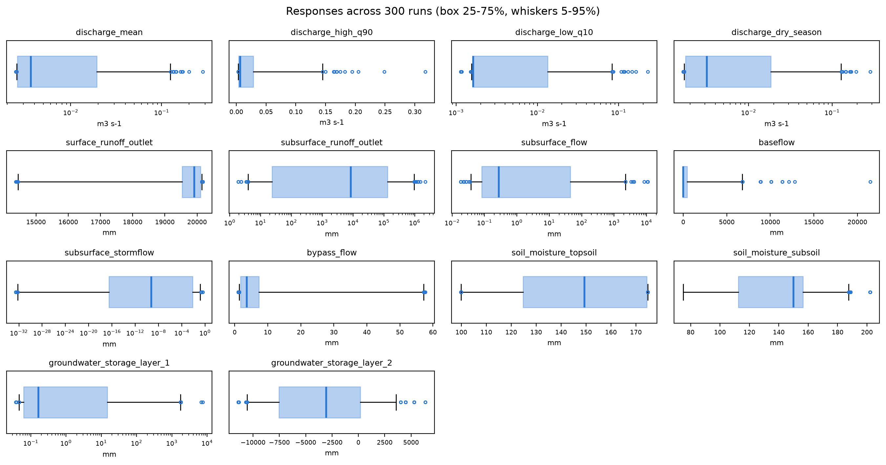
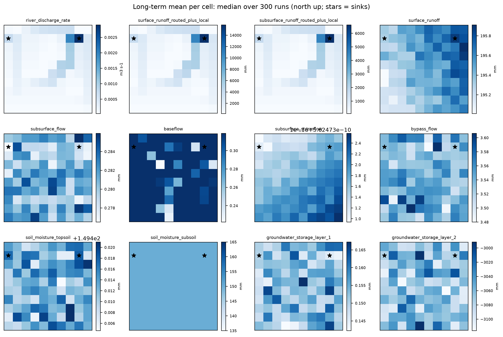
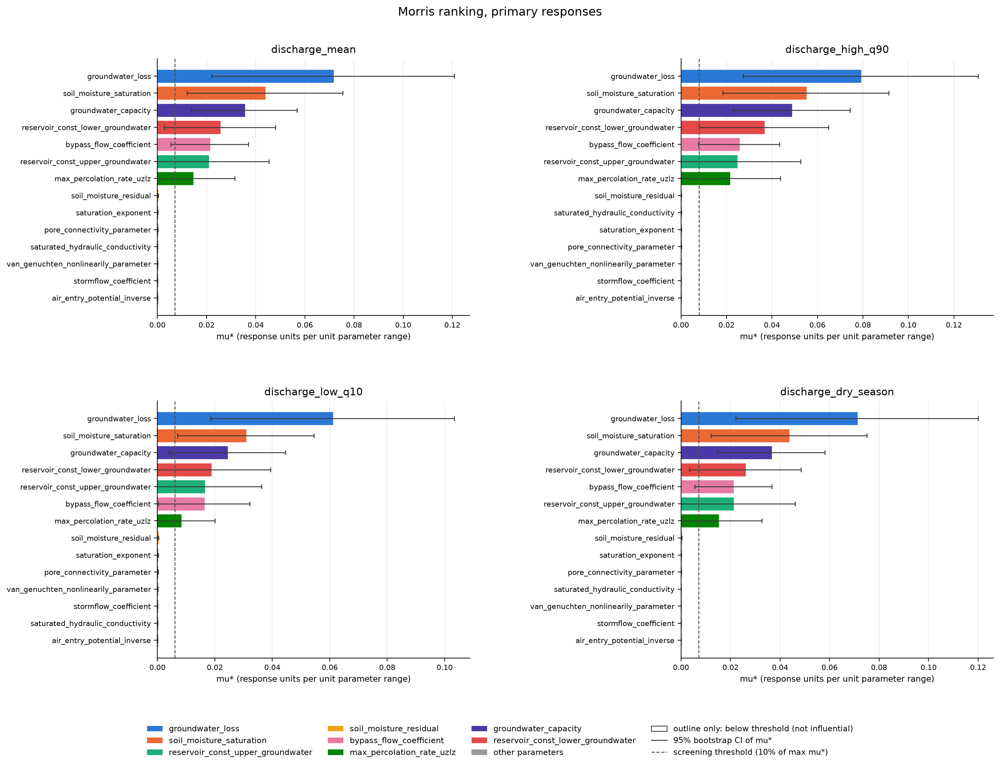
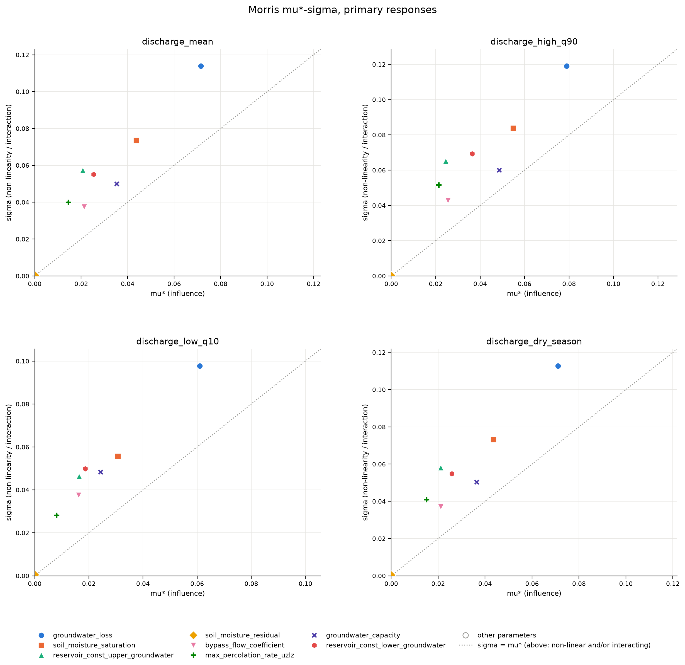
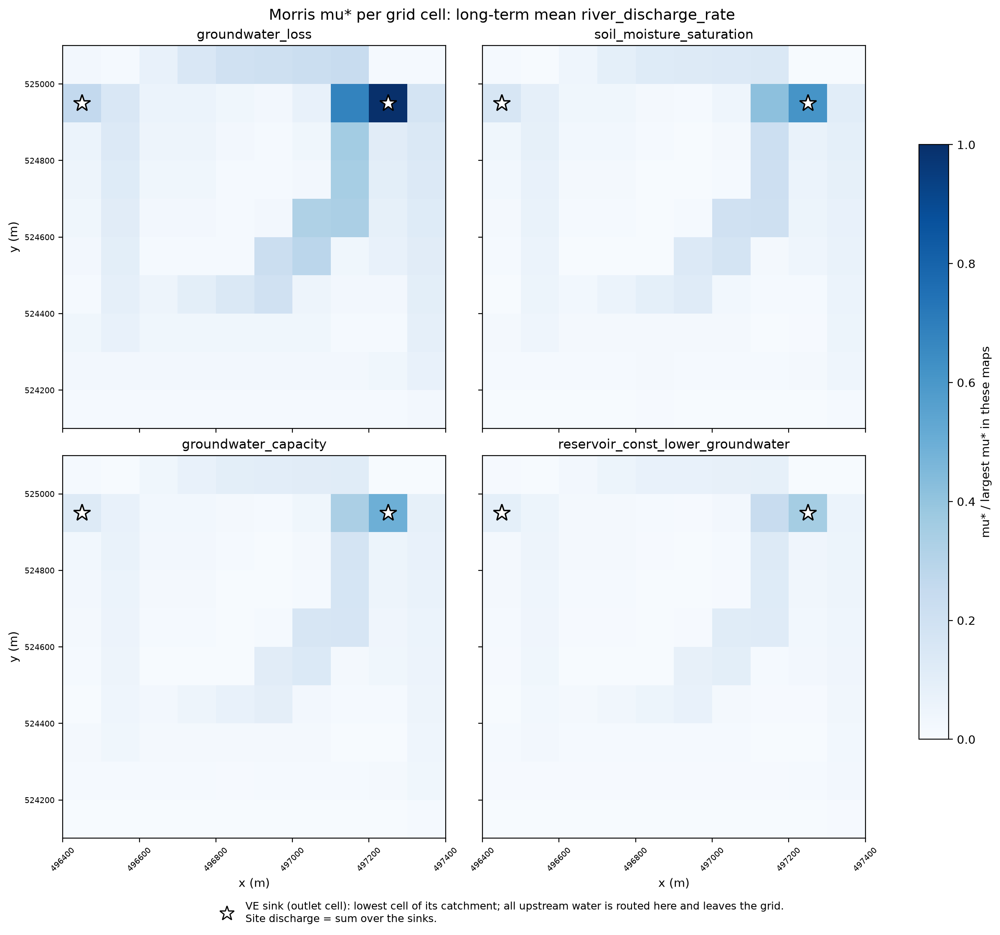
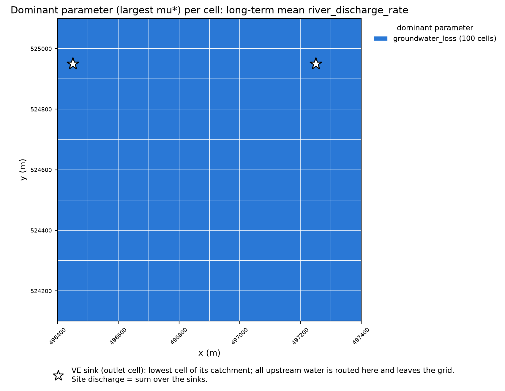
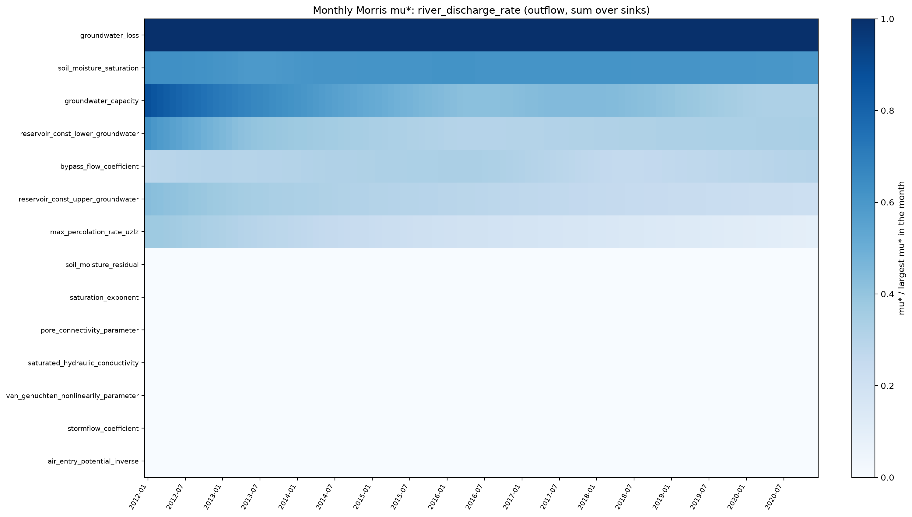
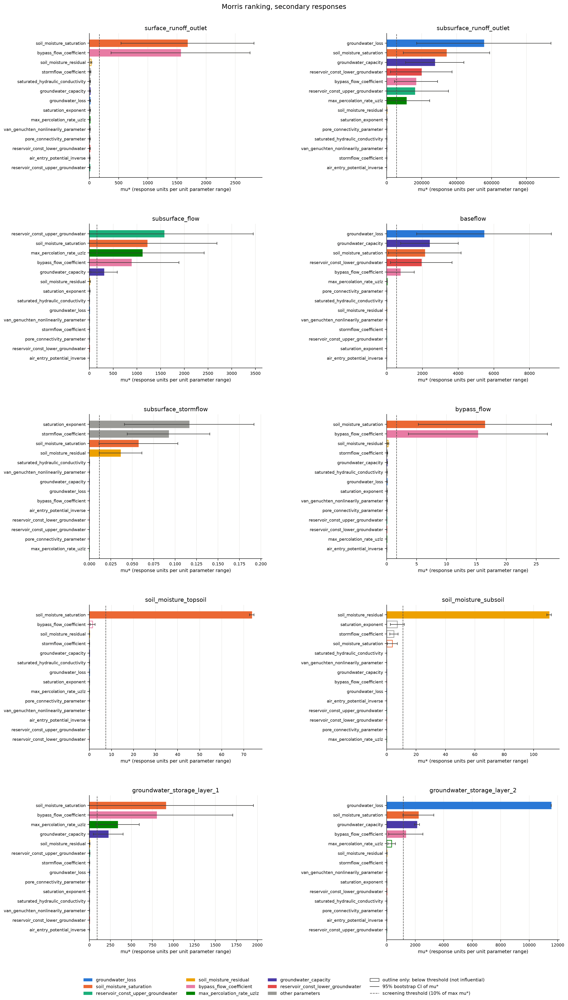
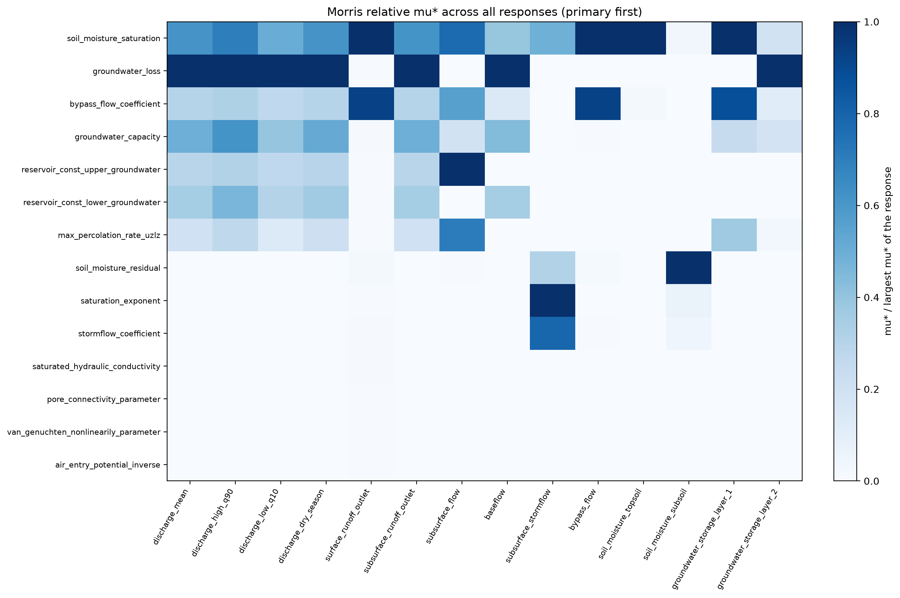

<!-- markdownlint-disable-file -->

# Morris screening of VE hydrology: main results

This notebook reports the results of one Morris screening run of the Virtual
Ecosystem (VE) hydrology module. It reads only the files written by
`analysis/abiotic/sensitivity/morris_analyse_hydrology.py`; it does not rerun the
model or recompute any index. The run, its design and its environment are listed in
*Report metadata and environment* below.

The notebook answers, in order:

1. Can the results be trusted? (design, runs and model health)
2. What did the runs produce? (output variables across runs, in time and in space)
3. Which parameters drive discharge at the site outlet? (primary responses)
4. How stable is that ranking?
5. Where and when do the parameters matter? (maps and months)
6. Which parameters drive the other hydrological processes? (secondary responses)
7. Which parameters go forward to the Sobol analysis?
8. What do the outputs and the Morris results reveal about the VE hydrology
   module?

Morris separates influential from non-influential parameters. It does not measure
shares of variance or interactions; that is the job of the Sobol stage.

The interpretation text is generated from the tables with fixed rules (for
example "strongly skewed" when the 95th percentile is more than five times the
median). The rules flag what to look at; the wording should still be checked by
hand before the results are reported.

## Report metadata and environment

The report, the Morris run and its uv environment in one place. The run facts come
from the run's design record and analysis files. The VE version and commit of the
runs are recorded in the notebook's run settings and compared with the packages
installed in the kernel that rendered this report.
The site is set in the notebook's run settings; the grid, soil layers and modules
come from the current base configuration, whose input files are checked against
its grid.


**Report and run**


| item | value |
|---|---|
| analyst | Lelavathy |
| date of report | 2026-09-23 |
| Morris run | `hydrology_morris_001` |
| design created | 2026-09-22 22:43 (from the job file) |
| analysis results | `data\sensitivity\hydrology\analysis\hydrology_morris_001` |
| design (job file) | `data/sensitivity/hydrology/config/arrayJob_config_hydrology_morris_001.toml` |
| parameter file | `data/sensitivity/hydrology/config/sensitivity_parameters.toml` |
| base configuration of the runs (design record) | `data/sensitivity/hydrology/config/static_hydro_configuration.toml` |
| base configuration read by this report | `data\sensitivity\hydrology\config\static_hydro_configuration.toml` |
| design | 300 runs, 14 parameters, trajectories = 20, levels = 4, seed 2026 |
| responses | 4 primary (`river_discharge_rate`), 10 secondary |
| analysis period | Jan 2012-Dec 2020, after a 24-month spin-up |
| dynamic modules | `hydrology` |
| static modules | `abiotic_simple`, `animal`, `plants`, `litter`, `soil` |
| grid and soil layers | 10 x 10 cells of 100 m; soil layers 250 mm (topsoil) and 750 mm (subsoil) |
| notebook | `notebook/hydrology/morris_sensitivity/morris_hydrology_results.md` |


Only modules with `static = false` are updated through time; static modules keep a fixed state, so the sensitivity reflects the dynamic module(s) alone.


**Environment**


| item | value |
|---|---|
| uv dependency group | `dev-pinned` |
| install | `uv sync --group dev-pinned` |
| Virtual Ecosystem used by the runs (`dev-pinned`) | `0.2.1`, commit `22689f01a2460953865244f2d79f162a32ff2003` |
| Virtual Ecosystem in this kernel | `0.2.1` |
| SALib used for sampling / in this kernel | `1.5.2` / `1.5.2` |
| Python in this kernel | `3.14.3` |


**Data used: `maliau_2` site**

```toml
[Scenario.maliau_2]
epsg_code = 32650
ll_x = 496400
ll_y = 524100
ur_x = 497400
ur_y = 525100
```


**Grid:** 10 x 10 cells of 100 m, origin `xoff = 496400`, `yoff = 524100` (matches the `maliau_2` lower-left corner).


**Site input data** (from `data\sensitivity\hydrology\data` when a configured path is not found). A gridded file matches when its cell centres equal the configuration grid: x 496450.0-497350.0, y 524150.0-525050.0.


| file | found | variables | x centres | y centres | matches configuration grid |
|---|---|---|---|---|---|
| `era5_maliau_10x10_2010_2020.nc` | yes | 10 | 496450.0-497350.0 | 524150.0-525050.0 | yes |
| `elevation_maliau_10x10.nc` | yes | 1 | 496450.0-497350.0 | 524150.0-525050.0 | yes |
| `soil_maliau.nc` | yes | 20 | 496450.0-497350.0 | 524150.0-525050.0 | yes |
| `litter_maliau.nc` | yes | 8 | 496450.0-497350.0 | 524150.0-525050.0 | yes |
| `plant_input_data_Maliau_10x10.nc` | yes | 3 | - | - | no x/y coordinates |


## Responses, outlets and primary vs secondary

### How the outlets are defined

VE hydrology has no river channel and no outflow across the grid boundary. Water
is routed between cells by VE's drainage rule
(`hydrology.above_ground.calculate_drainage_map`):

- Each cell drains to the neighbour with the largest elevation drop, among its
  four edge neighbours and itself.
- A cell lower than all of its neighbours drains to itself. It is a **sink**:
  everything routed into it stays there. The sinks are therefore the only places
  where water leaves the site, and they are the **outlets** used here.
- Routing is instantaneous within the monthly step. For each cell,
  `surface_runoff_routed_plus_local` and `subsurface_runoff_routed_plus_local`
  are that month's local runoff summed over the cell and every cell upstream of
  it. Local subsurface runoff is `subsurface_flow + baseflow +
  subsurface_stormflow`.
- `river_discharge_rate` is the routed surface plus subsurface runoff, converted
  to m³ s⁻¹.

The analysis script does not re-derive the network from elevation. It recovers
the network VE actually used from the first run's output: routed runoff equals
an upstream matrix times local runoff, and non-negative least squares returns
that matrix exactly (`outlet = {"method": "ve_routing"}`, written to
`data/drainage_network.csv`). Elevation is not sampled, so all runs share this
network.


The grid has **2 sinks**, draining 80, 20 of the 100 cells. With `combine = "sum"`, each outlet series is the **sum over the 2 sinks**: the total outflow of the site. (`"largest"` would keep only the 80-cell catchment.)

Each response is one statistic of that monthly series after the 24-month spin-up:


| response | group | VE variable | monthly series | statistic |
|---|---|---|---|---|
| discharge_mean | primary | river_discharge_rate | sum over the sinks | mean |
| discharge_high_q90 | primary | river_discharge_rate | sum over the sinks | 90th percentile |
| discharge_low_q10 | primary | river_discharge_rate | sum over the sinks | 10th percentile |
| discharge_dry_season | primary | river_discharge_rate | sum over the sinks | mean of Feb, Mar |
| surface_runoff_routed_plus_local | secondary | surface_runoff_routed_plus_local | sum over the sinks | mean |
| subsurface_runoff_routed_plus_local | secondary | subsurface_runoff_routed_plus_local | sum over the sinks | mean |
| subsurface_flow | secondary | subsurface_flow | domain mean | mean |
| baseflow | secondary | baseflow | domain mean | mean |
| subsurface_stormflow | secondary | subsurface_stormflow | domain mean | mean |
| bypass_flow | secondary | bypass_flow | domain mean | mean |
| soil_moisture_topsoil | secondary | soil_moisture_topsoil | domain mean | mean |
| soil_moisture_subsoil | secondary | soil_moisture_subsoil | domain mean | mean |
| groundwater_storage_layer_1 | secondary | groundwater_storage_layer_1 | domain mean | mean |
| groundwater_storage_layer_2 | secondary | groundwater_storage_layer_2 | domain mean | mean |


### Why discharge is primary and the rest secondary

- **`river_discharge_rate` is the primary response.** It is the single
  catchment-scale outcome of the module: it combines surface and subsurface
  pathways and the effect of every store on what leaves the site, and it is the
  variable that can be compared with stream gauge data. Its statistics (table
  above) cover the flow regime: mean flow, high flow (q90), low flow (q10) and
  a dry-season window.
- **The other responses are secondary.** They are the parts discharge is made
  of (routed surface and subsurface runoff at the outlets) and the local fluxes
  and stores behind them. They show *which process* a parameter acts through,
  and they reveal implausible behaviour that discharge alone would hide
  (Section 8).
- **Only the routed fields are summed over the sinks.** They accumulate water
  from upstream, so their sink values add up to the site total. Local fluxes and
  stores hold only their own cell's water, so their domain mean is the
  meaningful site value.
- **Primary vs secondary sets the Sobol screening rule, not scientific
  importance.** A parameter goes forward if it is influential for at least one
  primary response, or for at least two secondary responses (Section 7).

### Checks on the outlet definition

Three checks on the cached monthly series and long-term maps:

1. **Does the outlet capture all the site's runoff?** Routed runoff summed over
   the sinks, divided by local runoff summed over all cells. The expected value
   is (cells + sinks) / cells, not 1: VE lists a sink in its own upstream set,
   so each sink counts its own local runoff twice.
2. **How is discharge shared between the sinks?** Each sink's share of the
   long-term mean discharge, compared with its catchment size.
3. **Which pathway carries the discharge?** The subsurface share of routed
   outlet runoff across runs, and its rank correlation with `discharge_mean`.


**1. Routed runoff at the sinks / local runoff over all cells**


| pathway | p05 | median | p95 | expected |
|---|---|---|---|---|
| surface | 1.02 | 1.02 | 1.02 | 1.02 |
| subsurface | 1.01 | 1.02 | 1.03 | 1.02 |


**2. Share of site discharge by sink**


| sink (x, y) | cells draining through | share if runoff is uniform | median share over runs | 5-95% over runs |
|---|---|---|---|---|
| 497250.0, 524950.0 | 80 | 0.794 | 0.794 | 0.793-0.795 |
| 496450.0, 524950.0 | 20 | 0.206 | 0.206 | 0.205-0.207 |


**3. Which pathway carries the discharge**


| check | result |
|---|---|
| subsurface share of routed outlet runoff (p05 / median / p95) | 0.000 / 0.310 / 0.982 |
| runs where the subsurface carries more than half | 134 of 300 |
| Spearman: discharge_mean vs subsurface_runoff_routed_plus_local | 0.92 |
| Spearman: discharge_mean vs surface_runoff_routed_plus_local | -0.33 |


**Interpretation.**

- **The outlet definition is complete.** Routed runoff at the 2 sinks is about 1.02 (surface) and 1.02 (subsurface) times the local runoff of all 100 cells, against 1.02 expected from the sinks' double-counted own runoff. No water leaves the grid anywhere else, so the sink sum is the whole site outflow. The double count adds about 2% to every outlet value in every run, so it does not change the Morris rankings.
- **Each sink's share of discharge is fixed by its catchment size.** The sinks carry 79%, 21% of site discharge, close to what catchment size alone predicts, and this hardly changes between runs. The parameters change how much water leaves the site, not which sink it leaves through, so summing the sinks loses no sensitivity information; using only the largest catchment would scale every outlet value by about 0.79.
- **The subsurface pathway sets the discharge.** The subsurface share of outlet runoff has a median of 31% and is more than half in 134 of 300 runs. `discharge_mean` has a Spearman correlation of 0.92 with subsurface outlet runoff and -0.33 with surface outlet runoff. Parameters acting on that pathway are expected to dominate the primary responses (Sections 3 and 8.2).


## 1. Can the results be trusted?

### Design and runs

The design record for this run, as written by the analysis script, the sampled
range of each parameter and the per-run design cross-check
(`run_parameter_check.csv`):


| setting | value |
|---|---|
| run name | hydrology_morris_001 |
| method | morris |
| job file (the design) | data/sensitivity/hydrology/config/arrayJob_config_hydrology_morris_001.toml |
| parameter file | data/sensitivity/hydrology/config/sensitivity_parameters.toml |
| base configuration | data/sensitivity/hydrology/config/static_hydro_configuration.toml |
| parameters (D) | 14 |
| design settings (read from the job file) | trajectories = 20, levels = 4 |
| model runs | 300 |
| seed | 2026 |
| log10-sampled parameters | saturated_hydraulic_conductivity |
| SALib version used for sampling | 1.5.2 |


| parameter | lower | upper | scale |
|---|---|---|---|
| soil_moisture_residual | 0.1 | 0.25 | linear |
| soil_moisture_saturation | 0.4 | 0.7 | linear |
| saturated_hydraulic_conductivity | 6e-06 | 0.0008 | log10 |
| van_genuchten_nonlinearily_parameter | 1.2 | 2 | linear |
| pore_connectivity_parameter | 0.3 | 0.7 | linear |
| air_entry_potential_inverse | 0.01 | 0.1 | linear |
| groundwater_capacity | 200 | 1.5e+03 | linear |
| max_percolation_rate_uzlz | 0.5 | 10 | linear |
| groundwater_loss | 0.1 | 5 | linear |
| reservoir_const_upper_groundwater | 5 | 60 | linear |
| reservoir_const_lower_groundwater | 5 | 60 | linear |
| bypass_flow_coefficient | 0.1 | 2 | linear |
| stormflow_coefficient | 0.1 | 2 | linear |
| saturation_exponent | 1 | 3 | linear |


| status | n_runs |
|---|---|
| not checked (no record) | 300 |


No `compiled_configuration.toml` records were retained for this run, so per-run design fidelity could not be cross-checked from the run outputs alone. This is a gap in provenance, not evidence of a problem.


### Model health

Indices describe the model as it behaves. If the model does not conserve water, the
indices describe that behaviour rather than catchment hydrology. The table
summarises the health diagnostics over all runs; the thresholds are set in the
notebook's run settings (`health_tolerance`, `vertical_flow_min`).


| check | result |
|---|---|
| water balance closes within +/-5% of rainfall | 16 of 300 runs |
| lower groundwater store stays >= 0 | 76 of 300 runs |
| mean soil vertical flow >= 0.001 mm | 0 of 300 runs |
| mean soil vertical flow, mm (median over runs) | 2.4e-07 |
| total runoff / rainfall (median over runs) | 3.07 |
| surface runoff / rainfall (median over runs) | 0.96 |
| water balance closure, % of rainfall (min / median / max) | -10190.3 / -173.2 / 71.6 |


**Interpretation.** The model does not conserve water in this run. Only 16 of 300 runs close the water balance, and the median closure of about -173% of rainfall means that more water leaves the site as runoff, evaporation and storage change than falls as rain. Total runoff is about 3.1 times rainfall in the median run, and surface runoff alone is 96% of rainfall. The lower groundwater store goes negative in 224 of 300 runs. Soil vertical flow is below 0.001 mm in 300 of 300 runs. Section 8 sets out what these symptoms and the Morris rankings together suggest about the hydrology module. Every ranking below is therefore a sensitivity of the model as currently implemented, not of the maliau_2 catchment.


The water balance closure leaves out deep groundwater loss, because `groundwater_loss_mm` can only be filled from `compiled_configuration.toml`, which was not retained. Treat the closure figures as indicative.


## 2. What did the runs produce?

Before reading any sensitivity index, look at what the model produced. A Morris
index says how much a response changes when a parameter changes; it does not say
whether the response itself is realistic. The tables below come from the
`output_*` summaries written by the analysis script, and describe the responses
across the runs, through time and in space.

### 2.1 Responses across the runs

Each response is a statistic of one run's monthly series after spin-up. The table
gives its spread across the runs. `p95 / p05` measures how much the parameters
move a response; `cv` is the coefficient of variation across runs.


| response | unit | p05 | median | p95 | cv | p95 / p05 | n_runs_negative | n_runs_zero |
|---|---|---|---|---|---|---|---|---|
| discharge_mean | m3 s-1 | 0.00254 | 0.00366 | 0.125 | 1.88 | 49.1 | 0 | 0 |
| discharge_high_q90 | m3 s-1 | 0.00349 | 0.00654 | 0.145 | 1.69 | 41.6 | 0 | 0 |
| discharge_low_q10 | m3 s-1 | 0.00155 | 0.00161 | 0.0831 | 2.16 | 53.7 | 0 | 0 |
| discharge_dry_season | m3 s-1 | 0.0017 | 0.00316 | 0.128 | 1.93 | 75.3 | 0 | 0 |
| surface_runoff_routed_plus_local | mm | 1.44e+04 | 1.99e+04 | 2.01e+04 | 0.0706 | 1.4 | 0 | 0 |
| subsurface_runoff_routed_plus_local | mm | 3.97 | 8.36e+03 | 9.56e+05 | 2.15 | 2.41e+05 | 0 | 0 |
| subsurface_flow | mm | 0.0379 | 0.278 | 2.24e+03 | 3.7 | 5.9e+04 | 0 | 0 |
| baseflow | mm | 0 | 0.319 | 6.78e+03 | 2.6 | nan | 0 | 145 |
| subsurface_stormflow | mm | 6.15e-33 | 5.62e-10 | 0.142 | 2.4 | nan | 0 | 156 |
| bypass_flow | mm | 1.39 | 3.65 | 57.2 | 1.75 | 41.3 | 0 | 0 |
| soil_moisture_topsoil | mm | 99.9 | 149 | 175 | 0.202 | 1.75 | 0 | 0 |
| soil_moisture_subsoil | mm | 75 | 150 | 188 | 0.285 | 2.5 | 0 | 0 |
| groundwater_storage_layer_1 | mm | 0.0468 | 0.166 | 1.74e+03 | 3.21 | 3.71e+04 | 0 | 0 |
| groundwater_storage_layer_2 | mm | -1.06e+04 | -3.07e+03 | 3.59e+03 | 1.26 | nan | 216 | 0 |





**Interpretation.**

- **Discharge is strongly skewed.** The median run has a mean discharge of about 0.0037 m³ s⁻¹, the 95th percentile is about 0.12 m³ s⁻¹ (34 times larger) and the mean over runs (0.02 m³ s⁻¹) is 5.6 times the median. A minority of parameter sets produce far more outflow than the rest.
- **Surface runoff hardly depends on the parameters.** `surface_runoff_routed_plus_local` at the sinks has a coefficient of variation of 7% across runs.
- **The subsurface carries the extremes.** `subsurface_runoff_routed_plus_local` at the sinks spans about 5 orders of magnitude (5-95% range about 4 to 956,230 mm), so the high-discharge runs are those with large subsurface and groundwater outflow.
- **Some flows are switched off.** `baseflow` is exactly zero in 145 of 300 runs; `subsurface_stormflow` is exactly zero in 156 of 300 runs. Negligible (median below 1e-6 mm): `subsurface_stormflow`.
- **`groundwater_storage_layer_2` is negative on average in 216 of 300 runs.**


### 2.2 Do the soil stores sit at their bounds?

If a soil layer is full, its water content equals `soil_moisture_saturation`
times its thickness; if it is at its lower bound, it equals
`soil_moisture_residual` times its thickness. The layer thicknesses come from
`core.layers.soil_layers` in the base configuration. The table compares each
run's mean soil moisture with these two bounds.


| statistic | topsoil / (saturation x 250 mm) | subsoil / (residual x 750 mm) |
|---|---|---|
| min | 0.969 | 1 |
| 5% | 0.97 | 1 |
| 50% | 0.998 | 1 |
| 95% | 0.999 | 1.07 |
| max | 0.999 | 1.31 |


**Interpretation.** The topsoil holds 97%-100% of its saturated capacity, and the subsoil sits at its residual water content in 250 of 300 runs. Soil moisture also barely changes from month to month (Section 2.3). The soil column is therefore not a dynamic store in this run: the topsoil is full, so rain that reaches it runs off, and the subsoil receives almost no water from above.


### 2.3 Through time

For each field: the month with the highest and lowest median value, the size of
the seasonal cycle relative to the mean, and the drift over the analysis period
(the change from the first to the last year relative to the run's mean). A run
counts as rising or falling when it drifts by more than 10% of its mean.


| field | peak_month | low_month | seasonal range / mean | median drift / mean | n_runs_rising | n_runs_falling | share of run-months < 0 |
|---|---|---|---|---|---|---|---|
| river_discharge_rate | May | Feb | 0.325 | -0.156 | 24 | 247 | 0 |
| surface_runoff_routed_plus_local | May | Feb | 0.594 | -0.135 | 23 | 245 | 0 |
| subsurface_runoff_routed_plus_local | Jan | Dec | 0.926 | -0.909 | 81 | 197 | 0 |
| surface_runoff | May | Feb | 0.594 | -0.135 | 23 | 245 | 0 |
| subsurface_flow | Dec | Jan | 0.0799 | -0.915 | 101 | 199 | 0 |
| baseflow | Jan | Mar | 9.22 | -1.22 | 32 | 101 | 0 |
| subsurface_stormflow | Jan | Oct | nan | -3.38 | 0 | 86 | 0 |
| bypass_flow | Jan | Dec | 0.152 | -0.903 | 126 | 174 | 0 |
| soil_moisture_topsoil | Dec | Jan | 0.000736 | 0.00151 | 0 | 0 | 0 |
| soil_moisture_subsoil | Jan | Jan | 0 | -3.98e-16 | 0 | 43 | 0 |
| groundwater_storage_layer_1 | Jan | Dec | 0.171 | -0.883 | 101 | 199 | 0 |
| groundwater_storage_layer_2 | Jan | Dec | 0.244 | -1.43 | 32 | 246 | 0.691 |


**Interpretation.**

- **Discharge has a modest seasonal cycle.** It peaks in May and is lowest in Feb, with a seasonal range of 33% of its mean.
- **Not everything is at steady state.** More than half of the runs drift by over 10% of their mean for `river_discharge_rate` (247 falling, 24 rising, median change -16%); `surface_runoff_routed_plus_local` (245 falling, 23 rising, median change -13%); `subsurface_runoff_routed_plus_local` (197 falling, 81 rising, median change -91%); `surface_runoff` (245 falling, 23 rising, median change -13%); `subsurface_flow` (199 falling, 101 rising, median change -92%); `bypass_flow` (174 falling, 126 rising, median change -90%); `groundwater_storage_layer_1` (199 falling, 101 rising, median change -88%); `groundwater_storage_layer_2` (246 falling, 32 rising, median change -143%).
- Negative values: `groundwater_storage_layer_2` is below zero in 69% of all run-months.
- **Flat fields** (no seasonal cycle, no drift): `soil_moisture_topsoil` and `soil_moisture_subsoil`.
- **The 24-month spin-up is too short.** The stores are still changing through the analysis period. The Morris responses are means and percentiles over a period with a trend, so they mix the parameters' effect on the level of a flow with their effect on how fast the stores drain.


### 2.4 In space

For each field, the median over runs of its long-term mean in each cell. For the
routed (outlet) fields, the last column compares the sink cells with the average
cell.


| field | rule | cell_min | cell_max | spatial cv | largest at a sink | sink / mean cell |
|---|---|---|---|---|---|---|
| river_discharge_rate | outlet | 3.57e-05 | 0.0029 | 1.5 | True | 6.87 |
| surface_runoff_routed_plus_local | outlet | 195 | 1.58e+04 | 1.5 | True | 6.87 |
| subsurface_runoff_routed_plus_local | outlet | 81.5 | 6.63e+03 | 1.49 | True | 6.82 |
| surface_runoff | mean | 195 | 196 | 0.00106 |  |  |
| subsurface_flow | mean | 0.276 | 0.286 | 0.00776 |  |  |
| baseflow | mean | 0.222 | 0.319 | 0.0685 |  |  |
| subsurface_stormflow | mean | 5.62e-10 | 5.62e-10 | nan |  |  |
| bypass_flow | mean | 3.48 | 3.61 | 0.0071 |  |  |
| soil_moisture_topsoil | mean | 149 | 149 | 2.51e-05 |  |  |
| soil_moisture_subsoil | mean | 150 | 150 | 0 |  |  |
| groundwater_storage_layer_1 | mean | 0.142 | 0.167 | 0.0353 |  |  |
| groundwater_storage_layer_2 | mean | -3.12e+03 | -2.99e+03 | 0.00864 |  |  |





**Interpretation.** Most local fluxes and stores are almost the same in every cell: `surface_runoff`, `subsurface_flow`, `subsurface_stormflow`, `bypass_flow`, `soil_moisture_topsoil`, `soil_moisture_subsoil` and `groundwater_storage_layer_2` vary by less than 1% across the grid. `groundwater_storage_layer_2` is negative in 100 of 100 cells of the median map. The routed fields are largest at a sink, where they average about 6.9 times the mean cell, because upstream runoff accumulates along the drainage paths. The spatial patterns in the Morris maps (Section 5) are therefore patterns of the drainage network, not of local differences in hydrology.


### 2.5 Drainage network and grid location

The sinks recovered from the model output by the analysis script. The cell centres
written by this run are compared with the current base configuration, the elevation
input it names and the site definition in the notebook's run settings (`ll` + half a
cell to `ur` - half a cell). When the elevation input matches the current grid, the
sinks VE would find on it are listed too.


| x | y | cells draining through |
|---|---|---|
| 497250.0 | 524950.0 | 80 |
| 496450.0 | 524950.0 | 20 |


| grid | x centres | y centres |
|---|---|---|
| this run (model output) | 496450.0-497350.0 | 524150.0-525050.0 |
| current base configuration | 496450.0-497350.0 | 524150.0-525050.0 |
| elevation input (`elevation_maliau_10x10.nc`) | 496450.0-497350.0 | 524150.0-525050.0 |
| maliau_2 site definition | 496450.0-497350.0 | 524150.0-525050.0 |


**Sinks expected under the current base configuration** (VE's drainage rule applied to `elevation_maliau_10x10.nc`)


| x | y | elevation (m) | cells draining through |
|---|---|---|---|
| 497250.0 | 524950.0 | 211.6 | 80 |
| 496450.0 | 524950.0 | 241.5 | 20 |


**Interpretation.** 2 sinks drain 80, 20 of the 100 cells in this run, and all water leaves the site through them. The model grid matches the `maliau_2` site definition.


### 2.6 Discharge compared with the runoff reaching the sinks

`river_discharge_rate` should be the runoff routed to the sinks, converted from
depth (mm per month over the cell area) to a flow rate (m³ s⁻¹). The ratio below
compares that conversion with the discharge the model reports, month by month.


| statistic | routed runoff as m3 s-1 / reported discharge |
|---|---|
| 5% | 29 |
| median | 29 |
| 95% | 32.1 |


**Interpretation.** The runoff reaching the sinks corresponds to 29-32 times the discharge the model reports, which is about the number of days in a month. The reported discharge is therefore very likely too small by that factor, pointing to a time-step problem in the conversion to m³ s⁻¹. Because the factor is nearly constant, the Morris ranking and the relative mu\* are unaffected, but absolute discharge values and absolute mu\* for the primary responses should not be compared with observations.


## 3. Which parameters drive discharge at the outlet?

The primary responses are statistics of the monthly site outflow after the
spin-up (see the response table above). Site discharge is the outflow summed over
the VE sinks (the lowest cell of each catchment); the spatial maps in Section 5
mark those sinks.

In the bar charts each parameter keeps the same colour. A filled bar is
influential (mu\* at least 10% of the largest mu\* for that response); an outline
bar is not. Whiskers are 95% bootstrap confidence intervals.





The top parameters for each primary response. `sigma/mu*` above about 1 means the
effect changes a lot across the parameter space (non-linear or interacting). The
mu\*-sigma plane below separates parameters with a steady effect (below the line)
from those whose effect depends on the other parameters (above the line).


**discharge_mean**


| rank | parameter | mu_star | mu_star_conf | mu | sigma_over_mu_star |
|---|---|---|---|---|---|
| 1 | groundwater_loss | 0.0714 | 0.0494 | -0.0714 | 1.59 |
| 2 | soil_moisture_saturation | 0.0437 | 0.0317 | 0.0437 | 1.68 |
| 3 | groundwater_capacity | 0.0353 | 0.0214 | 0.0353 | 1.42 |
| 4 | reservoir_const_lower_groundwater | 0.0254 | 0.0226 | -0.0254 | 2.17 |
| 5 | bypass_flow_coefficient | 0.0213 | 0.0157 | -0.0213 | 1.76 |


**discharge_high_q90**


| rank | parameter | mu_star | mu_star_conf | mu | sigma_over_mu_star |
|---|---|---|---|---|---|
| 1 | groundwater_loss | 0.079 | 0.0517 | -0.079 | 1.51 |
| 2 | soil_moisture_saturation | 0.0549 | 0.0365 | 0.0549 | 1.53 |
| 3 | groundwater_capacity | 0.0486 | 0.0258 | 0.0486 | 1.24 |
| 4 | reservoir_const_lower_groundwater | 0.0364 | 0.0285 | -0.0364 | 1.9 |
| 5 | bypass_flow_coefficient | 0.0255 | 0.0178 | -0.0255 | 1.68 |


**discharge_low_q10**


| rank | parameter | mu_star | mu_star_conf | mu | sigma_over_mu_star |
|---|---|---|---|---|---|
| 1 | groundwater_loss | 0.0609 | 0.0424 | -0.0609 | 1.6 |
| 2 | soil_moisture_saturation | 0.0307 | 0.0238 | 0.0307 | 1.81 |
| 3 | groundwater_capacity | 0.0243 | 0.0203 | 0.0243 | 1.99 |
| 4 | reservoir_const_lower_groundwater | 0.0187 | 0.0208 | -0.0186 | 2.67 |
| 5 | reservoir_const_upper_groundwater | 0.0164 | 0.0199 | -0.0164 | 2.84 |


**discharge_dry_season**


| rank | parameter | mu_star | mu_star_conf | mu | sigma_over_mu_star |
|---|---|---|---|---|---|
| 1 | groundwater_loss | 0.071 | 0.0489 | -0.071 | 1.59 |
| 2 | soil_moisture_saturation | 0.0436 | 0.0315 | 0.0435 | 1.68 |
| 3 | groundwater_capacity | 0.0364 | 0.0216 | 0.0364 | 1.38 |
| 4 | reservoir_const_lower_groundwater | 0.0259 | 0.0225 | -0.0259 | 2.12 |
| 5 | bypass_flow_coefficient | 0.0211 | 0.0156 | -0.0211 | 1.76 |





**Interpretation.** `groundwater_loss` ranks first for all 4 discharge responses. Its negative mu means that a larger `groundwater_loss` gives less discharge.

All 4 statistics share the same top three (`groundwater_loss`, `soil_moisture_saturation` and `groundwater_capacity`; mu negative, positive, positive), and the rank correlation of mu\* between any two of them is at least 0.95. They therefore carry largely the same information about the model: high flows, low flows and dry-season flows are not controlled by different processes (Section 8.6).

Every top-5 parameter has sigma/mu\* above 1.2, and the 95% confidence interval on mu\* is typically 72% of mu\*. The effects are strongly non-linear or depend on the other parameters, so the Morris order is a screening result only; Sobol is needed to measure the interactions.


## 4. How stable is the ranking?

Each response was re-analysed by resampling trajectories with replacement. The
tables give each parameter's 5-95% rank range and the probability that it is in
the top `top_n`. A range that crosses the top-`top_n` boundary means more
trajectories would be needed to settle that parameter's place.


**5-95% rank range**


| parameter | discharge_mean | discharge_high_q90 | discharge_low_q10 | discharge_dry_season |
|---|---|---|---|---|
| bypass_flow_coefficient | 4-7 | 5-7 | 2-7 | 4-7 |
| groundwater_capacity | 2-5 | 1-4 | 2-6 | 2-5 |
| groundwater_loss | 1-2 | 1-3 | 1-1 | 1-2 |
| max_percolation_rate_uzlz |  | 4-7 |  | 3-7 |
| reservoir_const_lower_groundwater | 2-7 | 2-7 | 2-7 | 2-7 |
| reservoir_const_upper_groundwater | 3-7 | 3-7 | 3-7 | 2-7 |
| soil_moisture_saturation | 1-4 | 1-5 | 2-5 | 1-5 |


**Probability of being in the top 5**


| parameter | discharge_mean | discharge_high_q90 | discharge_low_q10 | discharge_dry_season |
|---|---|---|---|---|
| bypass_flow_coefficient | 0.64 | 0.43 | 0.66 | 0.59 |
| groundwater_capacity | 1 | 1 | 0.92 | 0.98 |
| groundwater_loss | 1 | 1 | 1 | 1 |
| max_percolation_rate_uzlz | 0 | 0.34 | 0 | 0.26 |
| reservoir_const_lower_groundwater | 0.66 | 0.8 | 0.66 | 0.7 |
| reservoir_const_upper_groundwater | 0.49 | 0.43 | 0.6 | 0.5 |
| soil_moisture_saturation | 0.99 | 1 | 0.96 | 0.96 |


**Interpretation.** `groundwater_capacity`, `groundwater_loss` and `soil_moisture_saturation` are in the top 5 in at least 92% of resamples for every primary response. The places below them are not: `reservoir_const_lower_groundwater`, `bypass_flow_coefficient`, `max_percolation_rate_uzlz` and `reservoir_const_upper_groundwater` have rank ranges that cross the top-5 boundary, so with 20 trajectories Morris cannot order them. This does not change the Sobol shortlist, because all of them go forward anyway.


## 5. Where and when do the parameters matter?

### Spatial pattern

Per-cell mu\* of the long-term mean primary variable. The stars are the VE sinks:
discharge in a cell includes everything routed through it, so sensitivity is
largest at the sinks and along their drainage paths.





The parameter with the largest mu\* in each cell:





### Through time

mu\* of the site outflow in each month, relative to the month's most influential
parameter. Seasonal bands show parameters that matter in wet or dry months only.





**How to read these maps.** Discharge in a cell is the sum of the runoff generated
in every cell upstream of it within the same step. The spatial pattern therefore
mostly shows the drainage network: sensitivity grows along each flow path and
peaks at the sinks. It is a map of where each process is locally strongest only
if the local fluxes differ between cells (Section 2.4). The monthly pattern should
be read with Section 8.6 in mind: if outflow has no memory of earlier months, it
reflects when runoff is generated, together with the random daily rainfall
pattern, rather than travel times through the catchment.

## 6. Which parameters drive the other hydrological processes?

Secondary responses: the routed runoff fields summed over the sinks, domain means
of the flow components, and soil and groundwater stores. They show which process
each parameter acts through. The heatmap shows all responses at once, each column
scaled to its most influential parameter.








The influential parameters of each secondary response, most influential first:


| response | influential parameters |
|---|---|
| baseflow | groundwater_loss, groundwater_capacity, soil_moisture_saturation, reservoir_const_lower_groundwater, bypass_flow_coefficient |
| bypass_flow | soil_moisture_saturation, bypass_flow_coefficient |
| groundwater_storage_layer_1 | soil_moisture_saturation, bypass_flow_coefficient, max_percolation_rate_uzlz, groundwater_capacity |
| groundwater_storage_layer_2 | groundwater_loss, soil_moisture_saturation, groundwater_capacity, bypass_flow_coefficient |
| soil_moisture_subsoil | soil_moisture_residual |
| soil_moisture_topsoil | soil_moisture_saturation |
| subsurface_flow | reservoir_const_upper_groundwater, soil_moisture_saturation, max_percolation_rate_uzlz, bypass_flow_coefficient, groundwater_capacity |
| subsurface_runoff_routed_plus_local | groundwater_loss, soil_moisture_saturation, groundwater_capacity, reservoir_const_lower_groundwater, bypass_flow_coefficient, reservoir_const_upper_groundwater, max_percolation_rate_uzlz |
| subsurface_stormflow | saturation_exponent, stormflow_coefficient, soil_moisture_saturation, soil_moisture_residual |
| surface_runoff_routed_plus_local | soil_moisture_saturation, bypass_flow_coefficient |


**Interpretation.** `soil_moisture_saturation` is influential for 9 of the 10 secondary responses, the widest reach of any parameter, even though it ranks only 2nd for discharge. `groundwater_loss`, the leading discharge parameter, is influential for `subsurface_runoff_routed_plus_local`, `baseflow` and `groundwater_storage_layer_2` and negligible for the other 7 secondary responses.

Parameters that matter for a single secondary response: `saturation_exponent` (subsurface_stormflow); `stormflow_coefficient` (subsurface_stormflow).

`air_entry_potential_inverse`, `pore_connectivity_parameter`, `saturated_hydraulic_conductivity` and `van_genuchten_nonlinearily_parameter` are influential for no response at all.


## 7. Which parameters go forward to Sobol?

A parameter is a Sobol candidate if it is influential for at least one primary
response, or for at least two secondary responses.


| parameter | n_primary_influential | n_secondary_influential | max_mu_star_rel_primary | mean_sigma_over_mu_star_primary | sobol_candidate | reason |
|---|---|---|---|---|---|---|
| groundwater_loss | 4 | 3 | 1 | 1.57 | True | influential for a primary response |
| soil_moisture_saturation | 4 | 9 | 0.695 | 1.68 | True | influential for a primary response |
| groundwater_capacity | 4 | 5 | 0.615 | 1.51 | True | influential for a primary response |
| reservoir_const_lower_groundwater | 4 | 2 | 0.461 | 2.22 | True | influential for a primary response |
| bypass_flow_coefficient | 4 | 7 | 0.323 | 1.88 | True | influential for a primary response |
| reservoir_const_upper_groundwater | 4 | 2 | 0.311 | 2.76 | True | influential for a primary response |
| max_percolation_rate_uzlz | 4 | 3 | 0.27 | 2.85 | True | influential for a primary response |
| soil_moisture_residual | 0 | 2 | 0.00276 | 2.86 | True | influential for >= 2 secondary responses |
| saturation_exponent | 0 | 1 | 0.00199 | 3.16 | False | screened out |
| pore_connectivity_parameter | 0 | 0 | 0.0019 | 2.83 | False | screened out |
| van_genuchten_nonlinearily_parameter | 0 | 0 | 0.00147 | 2.14 | False | screened out |
| saturated_hydraulic_conductivity | 0 | 0 | 0.00128 | 1.86 | False | screened out |
| stormflow_coefficient | 0 | 1 | 0.000862 | 1.79 | False | screened out |
| air_entry_potential_inverse | 0 | 0 | 0.000349 | 1.84 | False | screened out |


    8 Sobol candidates:
      - groundwater_loss
      - soil_moisture_saturation
      - groundwater_capacity
      - reservoir_const_lower_groundwater
      - bypass_flow_coefficient
      - reservoir_const_upper_groundwater
      - max_percolation_rate_uzlz
      - soil_moisture_residual


**Interpretation.** 8 parameters go forward: 7 influential for at least one discharge response (7 of them for all 4), plus `soil_moisture_residual`, which qualifies through secondary responses. 6 are screened out, including 4 of the 4 soil hydraulic parameters. The shortlist summarises the model as it runs now; check Section 8 before dropping any parameter permanently, because a parameter can look inert when the process it controls is switched off.


## 8. What the outputs and the Morris results reveal about the VE hydrology module

This section brings together the model health diagnostics (Section 1), the output
summaries (Section 2) and the Morris indices (Sections 3-7). Each check gives the
evidence first and then what it suggests, and is marked **not flagged** when the
run passes it. These are symptoms seen in this run's outputs, not a diagnosis of
the code; they should be raised with the VE developers and checked there before
being treated as definitive.


### 8.1 Is water conserved?


**Evidence.** 284 of 300 runs fail to close the water balance within ±5% of rainfall, with a median closure of about -173% (Section 1). In the median run the water leaving as runoff is about 3.1 times the rainfall, and up to about 103 times in the most extreme run (table below). Surface runoff alone is about 96% of rainfall and its outlet total varies by 7% between runs (Section 2.1).

**What it suggests.** Some part of the module releases more water than it receives. Because nearly all rainfall already leaves as surface runoff, the excess must come from the subsurface and groundwater flows, which are also where the runs differ most. Section 8.2 checks the groundwater stores as a likely source.


| statistic | total runoff / rainfall |
|---|---|
| min | 0.992 |
| median | 3.07 |
| max | 103 |


### 8.2 Do the groundwater stores behave as reservoirs?


**Evidence.**

- The lower groundwater store is negative at some point in 224 of 300 runs, negative on average in 216 runs, negative in 100 of 100 cells of the median map and in 69% of all run-months, and it falls in 246 runs (Sections 1, 2.1, 2.3 and 2.4).
- Baseflow is exactly zero in 145 runs, 145 of which have a negative lower store (table below).
- Across runs, `groundwater_loss` and the mean lower store have a correlation of -0.90 (table below).
- Worst primary rank of the groundwater parameters: `groundwater_capacity` 3, `groundwater_loss` 1, `reservoir_const_lower_groundwater` 4, `reservoir_const_upper_groundwater` 6 (Section 3).


| check | result |
|---|---|
| runs with mean lower store < 0 | 216 |
| runs with zero baseflow | 145 |
| runs with zero baseflow and lower store < 0 | 145 |
| correlation: groundwater_loss vs mean lower store | -0.9 |


**What it suggests.**

- A store that goes negative means water is removed from it whether or not there is any left, so the lower store has no lower bound. The "lost" water in those runs never existed.
- `groundwater_loss` can act like a switch: depending on the balance of percolation and loss, the lower store either keeps baseflow going or collapses below zero and baseflow stops.
- `groundwater_capacity` increases discharge. A capacity should limit storage; here it behaves more like the amount of water the store starts with, which then keeps feeding flow while the store drains.
- Together with Section 8.1, this points to the groundwater reservoirs as a place where water is created: their outflows do not appear to draw the stores down in a mass-conserving way.


### 8.3 Is the soil column active?


**Evidence.**

- The topsoil holds 97%-100% of its saturated capacity, and the subsoil sits at its residual water content in 250 of 300 runs, with no seasonal cycle (Sections 2.2 and 2.3).
- Mean soil vertical flow is below 0.001 mm in 300 of 300 runs, with a median of about 2.4e-07 mm (Section 1).
- The 4 soil hydraulic parameters have a largest relative mu\* below 0.01 for every one of the 14 responses (table below).

**What it suggests.** Water hardly moves between the soil layers or into groundwater, so the soil is a full bucket on top of an empty one. Rain that reaches the full topsoil runs off at the surface, and groundwater can be recharged mainly by bypass flow. The soil hydraulic parameters are screened out because the process they control is inactive, not necessarily because it is unimportant. The sampled saturated hydraulic conductivities correspond to about 520 to 69,120 mm per day (if in m s⁻¹); a mean vertical flux of 2.4e-07 mm is many orders of magnitude smaller, which suggests a unit or scaling problem rather than a physical result.


| parameter | largest mu*_rel, any response | sobol_candidate |
|---|---|---|
| pore_connectivity_parameter | 0.00576 | False |
| van_genuchten_nonlinearily_parameter | 0.00591 | False |
| saturated_hydraulic_conductivity | 0.00804 | False |
| air_entry_potential_inverse | 0.00469 | False |


### 8.4 Is the reported discharge consistent with the runoff?


**Evidence.** Converting the runoff that reaches the sinks to m³ s⁻¹ gives 29-32 times the discharge the model reports (median 29.0; Section 2.6).

**What it suggests.** The conversion of runoff to `river_discharge_rate` probably divides by the number of days once too often. The factor is nearly constant, so Morris rankings and relative mu\* are unaffected, but absolute discharge and absolute mu\* for the primary responses should not be compared with observations or with other studies.


### 8.5 Is the model at steady state?


**Evidence.** Discharge falls over Jan 2012-Dec 2020 in 247 of 300 runs. 8 of 12 fields drift by more than 10% in more than half of the runs (median change -143% to -13%), despite the 24-month spin-up (Section 2.3).

**What it suggests.** The stores are still draining (or filling) from their initial state throughout the analysis period. Mean and percentile responses then depend on how much initial water is left to drain. A longer spin-up, or responses computed only once the stores have settled, would separate the parameters' effect on the flow regime from their effect on the initial drainage.


### 8.6 Does discharge have process, time and spatial structure?


**Evidence.** The 4 discharge responses rank the parameters in almost the same order (rank correlation ≥ 0.95), with the same top three (Sections 3 and 4). Local fluxes and stores are nearly identical in every cell, and only the routed fields vary in space, following the drainage paths to the 2 sinks (Sections 2.4 and 2.5).

**What it suggests.** In a real catchment, high flows are usually driven by fast surface and stormflow processes and low flows by slow groundwater drainage. Here the same parameters control all flow levels, which points to discharge being the same-step sum of upstream runoff, with no routing delay or channel storage. With spatially uniform local hydrology, the Morris maps show where water accumulates, not where processes differ. All outflow leaves through internal sinks, so the site outlet is defined by the lowest cells of the grid rather than by a river leaving the domain; whether the sink cells are handled correctly should be checked.


### 8.7 Does the configuration grid match the maliau_2 site?


**Not flagged:** the model grid matches the site definition.


### 8.8 Is the noise floor known?


VE splits monthly rainfall into days at random, and this design has no replicate runs. The part of each index due to rainfall noise is therefore unknown, and small differences between parameters near the screening threshold should not be over-interpreted.


### 8.9 Suggested next steps

Generated from the checks flagged above.


- Raise the water balance error with the VE developers, with the evidence in Section 8.1.
- Raise the negative groundwater storage (Section 8.2) with the VE developers.
- Raise the pinned soil moisture and near-zero vertical flow (Section 8.3), including the hydraulic conductivity units.
- Check the conversion of routed runoff to `river_discharge_rate` (Section 8.4).
- Use a longer spin-up, or compute the responses once the stores have settled (Section 8.5).
- Add a few replicate runs (`replicates` in `morris_sample.py`) to estimate the noise floor (Section 8.8).
- Once these are resolved, repeat the Morris screening before running Sobol. The influential set, and especially the role of any parameter whose process is switched off, is likely to change.
- Keep `compiled_configuration.toml` for each run, so that the per-run design check and the groundwater loss term in the water balance can be computed.


## Interpretation notes

- Read the indices together with the outputs (Section 2): a parameter can be
  influential only because it controls a store that drifts, goes negative or is
  pinned at a bound (Section 8).
- The ranking inside the candidate set is approximate. Sobol quantifies each
  parameter's share of the output variance and its interactions.
- Parameters that look inert may be switched off by the model rather than
  unimportant (Section 8.3).
- VE splits monthly rain into days at random; without replicate runs the noise
  floor of the indices is not assessed (Section 8.8).
- Per-run design cross-checking depends on `compiled_configuration.toml` records
  being retained for the run; when they are not (Section 1), the design table and
  parameter ranges are the available provenance for the run.
