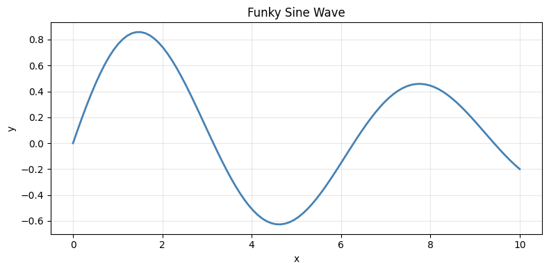

# Day 2 in Silwood


```python
print(1+2)
```

    3


## Data Analysis below


```python
for i in range(3):
    print(i)

my_var = 5
```

    0
    1
    2


```python
print(my_var)
```

    5


```python
import matplotlib.pyplot as plt
import numpy as np

x = np.linspace(0, 10, 100)
y = np.sin(x) * np.exp(-x * 0.1)

plt.figure(figsize=(8, 4))
plt.plot(x, y, color="steelblue", linewidth=2)
plt.title("Funky Sine Wave")
plt.xlabel("x")
plt.ylabel("y")
plt.grid(True, alpha=0.3)
plt.tight_layout()
plt.show()
```





Long piece of text Long piece of text Long piece of text Long piece of text Long piece
of text Long piece of text Long piece of text Long piece of text Long piece of text Long
piece of text Long piece of text Long piece of text Long piece of text Long piece of
text Long piece of text Long piece of text Long piece of text Long piece of text Long
piece of text


```python

```
